# Design Document: 地下停车场管理系统

## Overview

地下停车场管理系统是一个企业级多小区 SaaS 平台，采用单体应用架构配合模块化分层设计，为物业管理方与业主提供停车场智能化管理服务。系统核心功能包括：

- **多小区数据隔离**：基于 community_id 的严格数据隔离机制
- **房屋号数据域管理**：以 (community_id + house_no) 为数据域单位，支持同房屋号多业主数据共享
- **Primary 车辆先到先得机制**：每个房屋号最多1个 Primary 车辆，享受自动入场权限
- **Visitor 权限时长配额管理**：24小时单次时长限制 + 月度72小时配额管理
- **完整审计追溯**：操作日志与访问日志永久保留，支持完整审计链路

系统设计遵循以下原则：
1. **数据准确性**：通过分布式锁、行级锁、幂等键确保并发场景下的数据一致性
2. **可追溯性**：所有关键操作记录完整的 before/after 状态
3. **扩展性**：预留微服务拆分边界、硬件对接接口、缴费功能接口
4. **安全合规**：脱敏处理、签名验证、防重放、IP 白名单、限流机制

## Architecture

### 系统整体架构

```
┌─────────────────────────────────────────────────────────────┐
│                        Client Layer                          │
│  ┌──────────────────┐              ┌──────────────────┐     │
│  │   Owner_App      │              │  Admin_Portal    │     │
│  │  (业主小程序)     │              │  (物业管理后台)   │     │
│  └──────────────────┘              └──────────────────┘     │
└─────────────────────────────────────────────────────────────┘
                            │
                            │ HTTPS + JWT
                            ▼
┌─────────────────────────────────────────────────────────────┐
│                      Gateway Layer                           │
│  ┌──────────────────────────────────────────────────────┐   │
│  │  API Gateway (Nginx / Spring Cloud Gateway)         │   │
│  │  - 限流                                               │   │
│  │  - 签名验证                                           │   │
│  │  - 防重放                                             │   │
│  │  - 路由转发                                           │   │
│  └──────────────────────────────────────────────────────┘   │
└─────────────────────────────────────────────────────────────┘
                            │
                            ▼
┌─────────────────────────────────────────────────────────────┐
│                    Application Layer                         │
│                   (Spring Boot Monolith)                     │
│                                                               │
│  ┌──────────────┐  ┌──────────────┐  ┌──────────────┐      │
│  │ User Module  │  │Vehicle Module│  │ Entry Module │      │
│  │ 用户模块      │  │ 车辆模块      │  │ 入场记录模块  │      │
│  └──────────────┘  └──────────────┘  └──────────────┘      │
│                                                               │
│  ┌──────────────┐  ┌──────────────┐  ┌──────────────┐      │
│  │Visitor Module│  │Report Module │  │ Audit Module │      │
│  │访客权限模块   │  │ 报表模块      │  │ 审计模块      │      │
│  └──────────────┘  └──────────────┘  └──────────────┘      │
│                                                               │
│  ┌─────────────────────────────────────────────────────┐    │
│  │           Common Infrastructure Layer                │    │
│  │  - 认证鉴权 (JWT)                                    │    │
│  │  - 幂等处理                                          │    │
│  │  - 分布式锁 (Redis)                                  │    │
│  │  - 缓存管理 (Redis)                                  │    │
│  │  - 异步任务 (ThreadPool)                            │    │
│  │  - 日志记录                                          │    │
│  └─────────────────────────────────────────────────────┘    │
└─────────────────────────────────────────────────────────────┘
                            │
                            ▼
┌─────────────────────────────────────────────────────────────┐
│                      Data Layer                              │
│  ┌──────────────────┐              ┌──────────────────┐     │
│  │   MySQL 8.0      │              │    Redis 6.x     │     │
│  │  - 业务数据       │              │  - 缓存          │     │
│  │  - 分表/分区      │              │  - 分布式锁      │     │
│  │  - 冷热分层       │              │  - 幂等键        │     │
│  └──────────────────┘              └──────────────────┘     │
└─────────────────────────────────────────────────────────────┘
```

### 模块划分与职责

#### 1. User Module (用户模块)
- 业主注册、审核、账号管理
- 管理员账号管理
- 房屋号绑定与数据域管理
- 敏感信息修改审批

#### 2. Vehicle Module (车辆模块)
- 车牌管理（添加、删除、查询）
- Primary 车辆设置与切换
- 车牌格式验证
- 车牌状态管理

#### 3. Entry Module (入场记录模块)
- 车辆入场校验与记录
- 车辆出场记录
- 异常出场处理
- 入场记录分表管理

#### 4. Visitor Module (访客权限模块)
- Visitor 权限申请与审批
- Visitor 权限激活与时长累计
- 月度配额管理
- Visitor 可开放车位数计算

#### 5. Report Module (报表模块)
- 入场趋势统计
- 车位使用率分析
- 峰值时段分析
- 僵尸车辆统计
- 预聚合表管理

#### 6. Audit Module (审计模块)
- 操作日志记录
- 访问日志记录
- 审计日志查询
- 日志归档管理

### 微服务拆分边界预留

系统采用单体应用架构，但在设计上预留了微服务拆分边界：

```
┌─────────────────────────────────────────────────────────────┐
│                    Future Microservices                      │
│                                                               │
│  ┌──────────────┐  ┌──────────────┐  ┌──────────────┐      │
│  │User Service  │  │Vehicle Service│ │ Entry Service│      │
│  │              │  │              │  │              │      │
│  └──────────────┘  └──────────────┘  └──────────────┘      │
│                                                               │
│  ┌──────────────┐  ┌──────────────┐  ┌──────────────┐      │
│  │Visitor Service│ │Report Service│  │ Audit Service│      │
│  │              │  │              │  │              │      │
│  └──────────────┘  └──────────────┘  └──────────────┘      │
│                                                               │
│  Communication: gRPC / REST / Message Queue                  │
└─────────────────────────────────────────────────────────────┘
```

拆分原则：
- 按业务领域拆分，每个模块可独立部署
- 使用 community_id 作为数据分片键
- 跨服务调用通过 API Gateway 或消息队列
- 共享数据通过事件驱动同步


## Components and Interfaces

### 核心组件设计

#### 1. Authentication & Authorization Component

```java
// JWT Token 管理
public interface JwtTokenService {
    String generateAccessToken(Long userId, String role, Long communityId);
    String generateRefreshToken(Long userId);
    Claims validateToken(String token);
    void revokeToken(String token);
}

// 权限校验
public interface AuthorizationService {
    void checkCommunityAccess(Long userId, Long communityId);
    void checkHouseNoAccess(Long userId, Long communityId, String houseNo);
    void checkIpWhitelist(String ip, String operation);
    void checkRolePermission(String role, String operation);
}
```

#### 2. Idempotency Component

```java
public interface IdempotencyService {
    // 检查并设置幂等键
    boolean checkAndSet(String idempotencyKey, String result, int expireSeconds);
    
    // 获取幂等结果
    Optional<String> getResult(String idempotencyKey);
    
    // 生成幂等键
    String generateKey(String operationType, Long communityId, Long targetId, String requestId);
}
```

#### 3. Distributed Lock Component

```java
public interface DistributedLockService {
    // 获取锁
    boolean tryLock(String lockKey, int timeoutSeconds);
    
    // 释放锁
    void unlock(String lockKey);
    
    // 带锁执行
    <T> T executeWithLock(String lockKey, Supplier<T> supplier);
}
```

#### 4. Parking Space Calculator

```java
public interface ParkingSpaceCalculator {
    // 计算可用车位数
    int calculateAvailableSpaces(Long communityId);
    
    // 计算 Visitor 可开放车位数
    int calculateVisitorAvailableSpaces(Long communityId);
    
    // 检查车位是否充足
    boolean checkSpaceAvailable(Long communityId, VehicleType vehicleType);
}
```

#### 5. Visitor Quota Manager

```java
public interface VisitorQuotaManager {
    // 计算月度配额使用量
    long calculateMonthlyUsage(Long communityId, String houseNo, YearMonth month);
    
    // 检查配额是否充足
    boolean checkQuotaSufficient(Long communityId, String houseNo);
    
    // 累计 Visitor 停放时长
    void accumulateDuration(Long visitorSessionId, LocalDateTime exitTime);
    
    // 检查超时
    List<VisitorSession> checkTimeout();
}
```

#### 6. Notification Service

```java
public interface NotificationService {
    // 发送订阅消息
    void sendSubscriptionMessage(Long userId, String templateId, Map<String, String> data);
    
    // 重试失败消息
    void retryFailedMessages();
}
```

### RESTful API 设计

#### API 版本管理
- 基础路径：`/api/v1`
- 版本策略：URL 路径版本控制

#### 统一响应格式

```json
{
  "code": 0,
  "message": "success",
  "data": {},
  "requestId": "req_20240115_123456_abc123"
}
```

#### 核心接口列表

##### 业主管理接口

```
POST   /api/v1/owners/register              业主注册
POST   /api/v1/owners/{ownerId}/audit       业主审核
GET    /api/v1/owners/{ownerId}             查询业主信息
POST   /api/v1/owners/{ownerId}/disable     注销业主账号
POST   /api/v1/owners/info-modify/apply     申请修改敏感信息
POST   /api/v1/owners/info-modify/{applyId}/audit  审批敏感信息修改
```

##### 车牌管理接口

```
POST   /api/v1/vehicles                     添加车牌
DELETE /api/v1/vehicles/{vehicleId}         删除车牌
GET    /api/v1/vehicles                     查询车牌列表
PUT    /api/v1/vehicles/{vehicleId}/primary 设置 Primary 车辆
```

##### 车辆入场出场接口

```
POST   /api/v1/parking/entry                车辆入场
POST   /api/v1/parking/exit                 车辆出场
GET    /api/v1/parking/records              查询入场记录
POST   /api/v1/parking/exit-exception/handle 处理异常出场
```

##### Visitor 权限接口

```
POST   /api/v1/visitors/apply               申请 Visitor 权限
POST   /api/v1/visitors/{visitorId}/audit   审批 Visitor 申请
GET    /api/v1/visitors                     查询 Visitor 权限列表
GET    /api/v1/visitors/quota               查询月度配额
```

##### 车位配置接口

```
GET    /api/v1/parking/config               查询车位配置
PUT    /api/v1/parking/config               修改车位配置
```

##### 报表接口

```
GET    /api/v1/reports/entry-trend          入场趋势报表
GET    /api/v1/reports/space-usage          车位使用率报表
GET    /api/v1/reports/peak-hours           峰值时段报表
GET    /api/v1/reports/zombie-vehicles      僵尸车辆报表
```

##### 导出接口

```
POST   /api/v1/exports/parking-records      导出入场记录
GET    /api/v1/exports/{exportId}/status    查询导出状态
GET    /api/v1/exports/{exportId}/download  下载导出文件
```

##### 审计日志接口

```
GET    /api/v1/audit/operation-logs         查询操作日志
GET    /api/v1/audit/access-logs            查询访问日志
POST   /api/v1/audit/logs/export            导出审计日志
```

##### 僵尸车辆处理接口

```
GET    /api/v1/zombie-vehicles              查询僵尸车辆列表
POST   /api/v1/zombie-vehicles/{zombieId}/handle  处理僵尸车辆
```

##### 批量操作接口

```
POST   /api/v1/owners/batch-audit           批量审核业主
POST   /api/v1/visitors/batch-audit         批量审批 Visitor
```

### 请求/响应示例

#### 业主注册请求

```json
POST /api/v1/owners/register
{
  "phoneNumber": "13812345678",
  "verificationCode": "123456",
  "communityId": 1001,
  "houseNo": "1-101",
  "idCardLast4": "1234",
  "timestamp": 1705305600000,
  "nonce": "abc123def456",
  "signature": "sha256_signature_here"
}
```

#### 业主注册响应

```json
{
  "code": 0,
  "message": "注册成功，等待审核",
  "data": {
    "ownerId": 10001,
    "status": "pending",
    "createTime": "2024-01-15T10:00:00"
  },
  "requestId": "req_20240115_100000_abc123"
}
```

#### 设置 Primary 车辆请求

```json
PUT /api/v1/vehicles/20001/primary
{
  "confirmToken": "confirm_token_from_second_check",
  "timestamp": 1705305600000,
  "nonce": "xyz789uvw012",
  "signature": "sha256_signature_here"
}
```

#### 查询入场记录请求

```json
GET /api/v1/parking/records?communityId=1001&houseNo=1-101&startTime=2024-01-01T00:00:00&endTime=2024-01-31T23:59:59&cursor=eyJlbnRlclRpbWUiOiIyMDI0LTAxLTE1VDEwOjAwOjAwIiwiaWQiOjEwMDAxfQ==&pageSize=20
```

#### 查询入场记录响应

```json
{
  "code": 0,
  "message": "success",
  "data": {
    "records": [
      {
        "id": 10001,
        "carNumber": "京A12345",
        "enterTime": "2024-01-15T10:00:00",
        "exitTime": "2024-01-15T18:30:00",
        "status": "exited",
        "duration": 510
      }
    ],
    "nextCursor": "eyJlbnRlclRpbWUiOiIyMDI0LTAxLTE0VDA5OjAwOjAwIiwiaWQiOjk5OTl9",
    "hasMore": true
  },
  "requestId": "req_20240115_100000_xyz789"
}
```

### 错误码设计

错误码格式：`PARKING_XXXX`

分类规则：
- 1xxx：认证与注册相关
- 2xxx：审核相关
- 3xxx：车牌管理相关
- 4xxx：Primary 车辆相关
- 5xxx：入场出场相关
- 7xxx：Visitor 权限相关
- 9xxx：车位配置相关
- 12xxx：权限与数据隔离相关
- 14xxx：账号管理相关
- 17xxx：数据脱敏与导出相关
- 19xxx：安全防护相关
- 20xxx：高危操作相关

详细错误码参见 requirements.md 中的 Error Codes Dictionary。

### JWT 鉴权机制

#### Token 结构

**Access Token (有效期2小时):**
```json
{
  "userId": 10001,
  "role": "owner",
  "communityId": 1001,
  "houseNo": "1-101",
  "exp": 1705313200,
  "iat": 1705305600
}
```

**Refresh Token (有效期7天):**
```json
{
  "userId": 10001,
  "tokenType": "refresh",
  "exp": 1705910400,
  "iat": 1705305600
}
```

#### Token 刷新流程

```
Client                    Server
  │                         │
  │  POST /api/v1/auth/refresh
  │  {refreshToken}         │
  ├────────────────────────>│
  │                         │
  │                         │ Validate Refresh Token
  │                         │ Generate New Access Token
  │                         │
  │  {accessToken}          │
  │<────────────────────────┤
  │                         │
```

### 签名验证机制

#### 签名算法

```
signature = SHA256(timestamp + nonce + requestBody + secretKey)
```

#### 签名验证流程

1. 提取请求中的 timestamp、nonce、signature
2. 验证 timestamp 在5分钟窗口内
3. 验证 nonce 未被使用（Redis 查询）
4. 重新计算签名并比对
5. 验证通过后将 nonce 存入 Redis（5分钟过期）


## Key Sequence Diagrams

### 1. 注册审核流程时序图

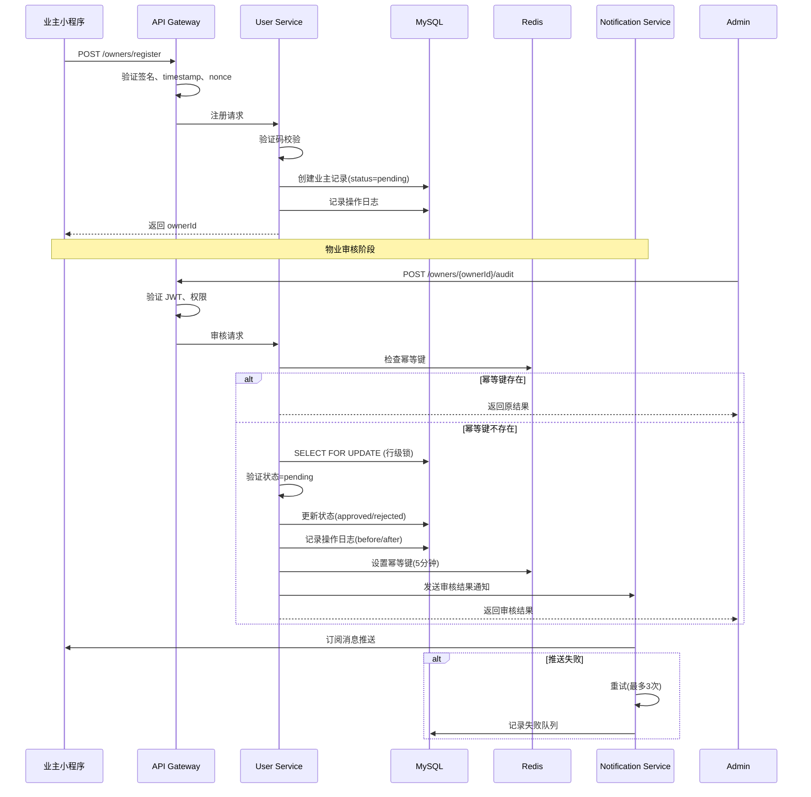
```mermaid
sequenceDiagram
    participant Owner as 业主小程序
    participant API as API Gateway
    participant UserService as User Service
    participant DB as MySQL
    participant Redis as Redis
    participant Notify as Notification Service
    
    Owner->>API: POST /owners/register
    API->>API: 验证签名、timestamp、nonce
    API->>UserService: 注册请求
    UserService->>UserService: 验证码校验
    UserService->>DB: 创建业主记录(status=pending)
    UserService->>DB: 记录操作日志
    UserService-->>Owner: 返回 ownerId
    
    Note over Owner,Notify: 物业审核阶段
    
    Admin->>API: POST /owners/{ownerId}/audit
    API->>API: 验证 JWT、权限
    API->>UserService: 审核请求
    UserService->>Redis: 检查幂等键
    alt 幂等键存在
        UserService-->>Admin: 返回原结果
    else 幂等键不存在
        UserService->>DB: SELECT FOR UPDATE (行级锁)
        UserService->>UserService: 验证状态=pending
        UserService->>DB: 更新状态(approved/rejected)
        UserService->>DB: 记录操作日志(before/after)
        UserService->>Redis: 设置幂等键(5分钟)
        UserService->>Notify: 发送审核结果通知
        UserService-->>Admin: 返回审核结果
    end
    
    Notify->>Owner: 订阅消息推送
    alt 推送失败
        Notify->>Notify: 重试(最多3次)
        Notify->>DB: 记录失败队列
    end
```

### 2. 房屋号绑定与信息同步时序图

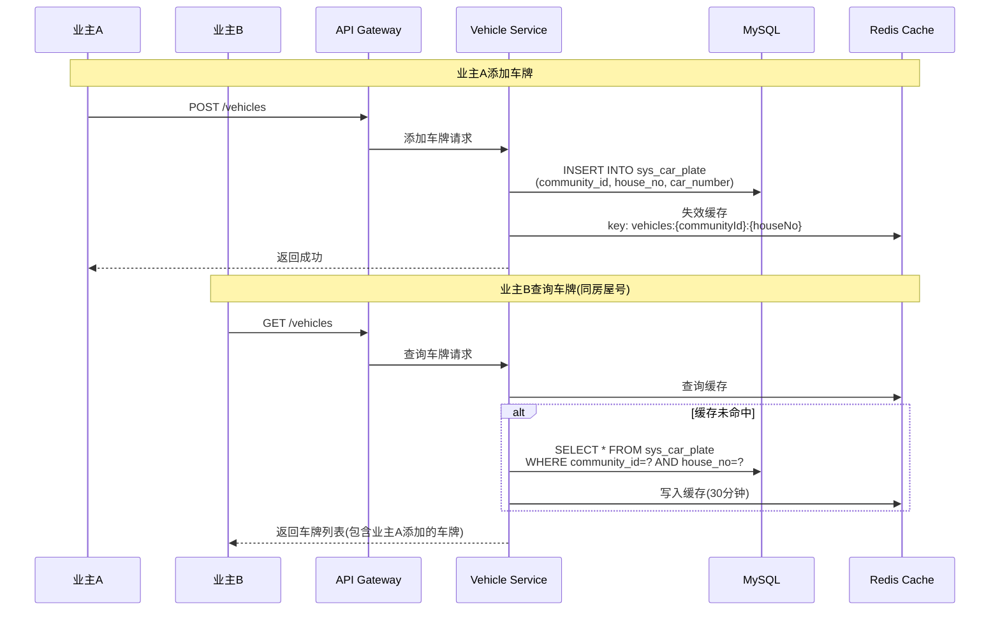
```mermaid
sequenceDiagram
    participant Owner1 as 业主A
    participant Owner2 as 业主B
    participant API as API Gateway
    participant VehicleService as Vehicle Service
    participant DB as MySQL
    participant Redis as Redis Cache
    
    Note over Owner1,Redis: 业主A添加车牌
    Owner1->>API: POST /vehicles
    API->>VehicleService: 添加车牌请求
    VehicleService->>DB: INSERT INTO sys_car_plate<br/>(community_id, house_no, car_number)
    VehicleService->>Redis: 失效缓存<br/>key: vehicles:{communityId}:{houseNo}
    VehicleService-->>Owner1: 返回成功
    
    Note over Owner2,Redis: 业主B查询车牌(同房屋号)
    Owner2->>API: GET /vehicles
    API->>VehicleService: 查询车牌请求
    VehicleService->>Redis: 查询缓存
    alt 缓存未命中
        VehicleService->>DB: SELECT * FROM sys_car_plate<br/>WHERE community_id=? AND house_no=?
        VehicleService->>Redis: 写入缓存(30分钟)
    end
    VehicleService-->>Owner2: 返回车牌列表(包含业主A添加的车牌)
```

### 3. Primary 车辆切换时序图

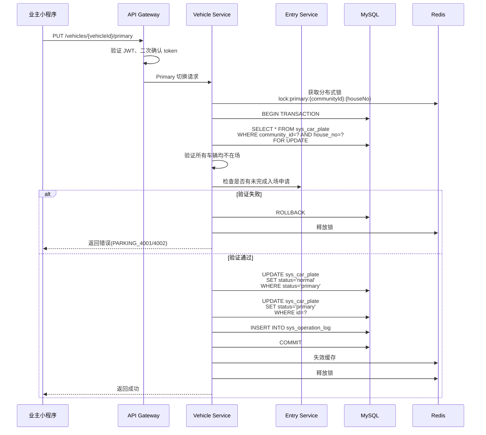
```mermaid
sequenceDiagram
    participant Owner as 业主小程序
    participant API as API Gateway
    participant VehicleService as Vehicle Service
    participant EntryService as Entry Service
    participant DB as MySQL
    participant Redis as Redis
    
    Owner->>API: PUT /vehicles/{vehicleId}/primary
    API->>API: 验证 JWT、二次确认 token
    API->>VehicleService: Primary 切换请求
    
    VehicleService->>Redis: 获取分布式锁<br/>lock:primary:{communityId}:{houseNo}
    
    VehicleService->>DB: BEGIN TRANSACTION
    VehicleService->>DB: SELECT * FROM sys_car_plate<br/>WHERE community_id=? AND house_no=?<br/>FOR UPDATE
    
    VehicleService->>VehicleService: 验证所有车辆均不在场
    VehicleService->>EntryService: 检查是否有未完成入场申请
    
    alt 验证失败
        VehicleService->>DB: ROLLBACK
        VehicleService->>Redis: 释放锁
        VehicleService-->>Owner: 返回错误(PARKING_4001/4002)
    else 验证通过
        VehicleService->>DB: UPDATE sys_car_plate<br/>SET status='normal'<br/>WHERE status='primary'
        VehicleService->>DB: UPDATE sys_car_plate<br/>SET status='primary'<br/>WHERE id=?
        VehicleService->>DB: INSERT INTO sys_operation_log
        VehicleService->>DB: COMMIT
        VehicleService->>Redis: 失效缓存
        VehicleService->>Redis: 释放锁
        VehicleService-->>Owner: 返回成功
    end
```

### 4. Primary 车辆自动入场时序图

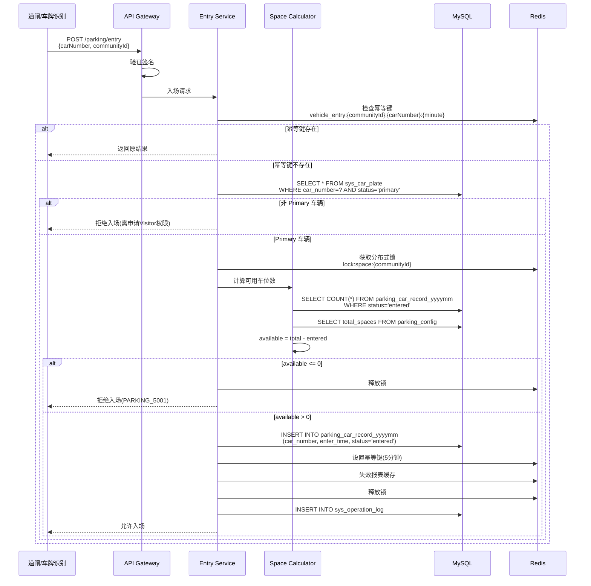
```mermaid
sequenceDiagram
    participant Gate as 道闸/车牌识别
    participant API as API Gateway
    participant EntryService as Entry Service
    participant SpaceCalc as Space Calculator
    participant DB as MySQL
    participant Redis as Redis
    
    Gate->>API: POST /parking/entry<br/>{carNumber, communityId}
    API->>API: 验证签名
    API->>EntryService: 入场请求
    
    EntryService->>Redis: 检查幂等键<br/>vehicle_entry:{communityId}:{carNumber}:{minute}
    alt 幂等键存在
        EntryService-->>Gate: 返回原结果
    else 幂等键不存在
        EntryService->>DB: SELECT * FROM sys_car_plate<br/>WHERE car_number=? AND status='primary'
        
        alt 非 Primary 车辆
            EntryService-->>Gate: 拒绝入场(需申请Visitor权限)
        else Primary 车辆
            EntryService->>Redis: 获取分布式锁<br/>lock:space:{communityId}
            EntryService->>SpaceCalc: 计算可用车位数
            SpaceCalc->>DB: SELECT COUNT(*) FROM parking_car_record_yyyymm<br/>WHERE status='entered'
            SpaceCalc->>DB: SELECT total_spaces FROM parking_config
            SpaceCalc->>SpaceCalc: available = total - entered
            
            alt available <= 0
                EntryService->>Redis: 释放锁
                EntryService-->>Gate: 拒绝入场(PARKING_5001)
            else available > 0
                EntryService->>DB: INSERT INTO parking_car_record_yyyymm<br/>(car_number, enter_time, status='entered')
                EntryService->>Redis: 设置幂等键(5分钟)
                EntryService->>Redis: 失效报表缓存
                EntryService->>Redis: 释放锁
                EntryService->>DB: INSERT INTO sys_operation_log
                EntryService-->>Gate: 允许入场
            end
        end
    end
```

### 5. 车辆出场时序图

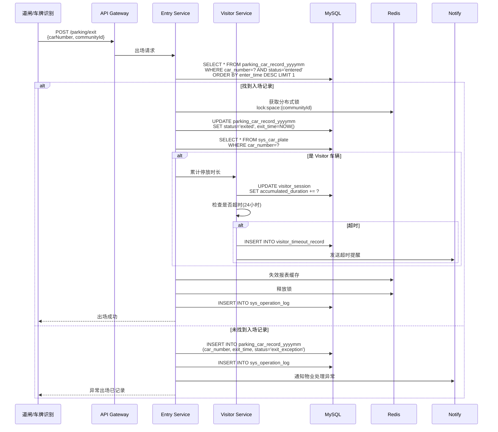
```mermaid
sequenceDiagram
    participant Gate as 道闸/车牌识别
    participant API as API Gateway
    participant EntryService as Entry Service
    participant VisitorService as Visitor Service
    participant DB as MySQL
    participant Redis as Redis
    
    Gate->>API: POST /parking/exit<br/>{carNumber, communityId}
    API->>EntryService: 出场请求
    
    EntryService->>DB: SELECT * FROM parking_car_record_yyyymm<br/>WHERE car_number=? AND status='entered'<br/>ORDER BY enter_time DESC LIMIT 1
    
    alt 找到入场记录
        EntryService->>Redis: 获取分布式锁<br/>lock:space:{communityId}
        EntryService->>DB: UPDATE parking_car_record_yyyymm<br/>SET status='exited', exit_time=NOW()
        
        EntryService->>DB: SELECT * FROM sys_car_plate<br/>WHERE car_number=?
        alt 是 Visitor 车辆
            EntryService->>VisitorService: 累计停放时长
            VisitorService->>DB: UPDATE visitor_session<br/>SET accumulated_duration += ?
            VisitorService->>VisitorService: 检查是否超时(24小时)
            alt 超时
                VisitorService->>DB: INSERT INTO visitor_timeout_record
                VisitorService->>Notify: 发送超时提醒
            end
        end
        
        EntryService->>Redis: 失效报表缓存
        EntryService->>Redis: 释放锁
        EntryService->>DB: INSERT INTO sys_operation_log
        EntryService-->>Gate: 出场成功
    else 未找到入场记录
        EntryService->>DB: INSERT INTO parking_car_record_yyyymm<br/>(car_number, exit_time, status='exit_exception')
        EntryService->>DB: INSERT INTO sys_operation_log
        EntryService->>Notify: 通知物业处理异常
        EntryService-->>Gate: 异常出场已记录
    end
```

### 6. Visitor 申请审批时序图

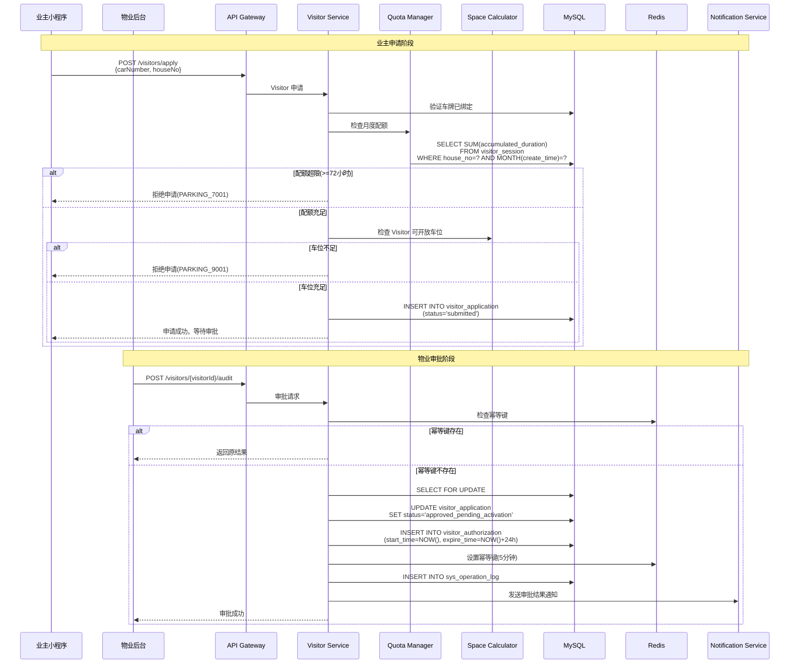
```mermaid
sequenceDiagram
    participant Owner as 业主小程序
    participant Admin as 物业后台
    participant API as API Gateway
    participant VisitorService as Visitor Service
    participant QuotaManager as Quota Manager
    participant SpaceCalc as Space Calculator
    participant DB as MySQL
    participant Redis as Redis
    participant Notify as Notification Service
    
    Note over Owner,Notify: 业主申请阶段
    Owner->>API: POST /visitors/apply<br/>{carNumber, houseNo}
    API->>VisitorService: Visitor 申请
    
    VisitorService->>DB: 验证车牌已绑定
    VisitorService->>QuotaManager: 检查月度配额
    QuotaManager->>DB: SELECT SUM(accumulated_duration)<br/>FROM visitor_session<br/>WHERE house_no=? AND MONTH(create_time)=?
    
    alt 配额超限(>=72小时)
        VisitorService-->>Owner: 拒绝申请(PARKING_7001)
    else 配额充足
        VisitorService->>SpaceCalc: 检查 Visitor 可开放车位
        alt 车位不足
            VisitorService-->>Owner: 拒绝申请(PARKING_9001)
        else 车位充足
            VisitorService->>DB: INSERT INTO visitor_application<br/>(status='submitted')
            VisitorService-->>Owner: 申请成功，等待审批
        end
    end
    
    Note over Admin,Notify: 物业审批阶段
    Admin->>API: POST /visitors/{visitorId}/audit
    API->>VisitorService: 审批请求
    
    VisitorService->>Redis: 检查幂等键
    alt 幂等键存在
        VisitorService-->>Admin: 返回原结果
    else 幂等键不存在
        VisitorService->>DB: SELECT FOR UPDATE
        VisitorService->>DB: UPDATE visitor_application<br/>SET status='approved_pending_activation'
        VisitorService->>DB: INSERT INTO visitor_authorization<br/>(start_time=NOW(), expire_time=NOW()+24h)
        VisitorService->>Redis: 设置幂等键(5分钟)
        VisitorService->>DB: INSERT INTO sys_operation_log
        VisitorService->>Notify: 发送审批结果通知
        VisitorService-->>Admin: 审批成功
    end
```

### 7. Visitor 授权激活与首次入场时序图

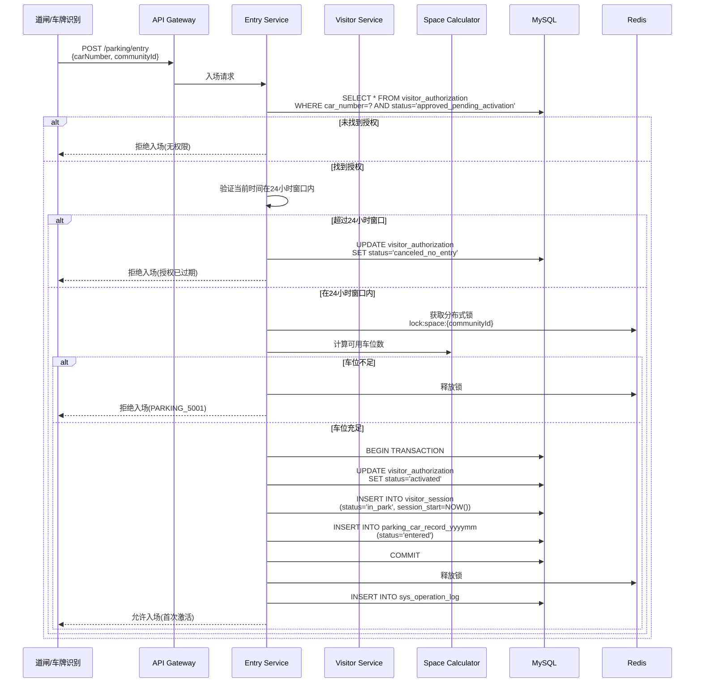
```mermaid
sequenceDiagram
    participant Gate as 道闸/车牌识别
    participant API as API Gateway
    participant EntryService as Entry Service
    participant VisitorService as Visitor Service
    participant SpaceCalc as Space Calculator
    participant DB as MySQL
    participant Redis as Redis
    
    Gate->>API: POST /parking/entry<br/>{carNumber, communityId}
    API->>EntryService: 入场请求
    
    EntryService->>DB: SELECT * FROM visitor_authorization<br/>WHERE car_number=? AND status='approved_pending_activation'
    
    alt 未找到授权
        EntryService-->>Gate: 拒绝入场(无权限)
    else 找到授权
        EntryService->>EntryService: 验证当前时间在24小时窗口内
        alt 超过24小时窗口
            EntryService->>DB: UPDATE visitor_authorization<br/>SET status='canceled_no_entry'
            EntryService-->>Gate: 拒绝入场(授权已过期)
        else 在24小时窗口内
            EntryService->>Redis: 获取分布式锁<br/>lock:space:{communityId}
            EntryService->>SpaceCalc: 计算可用车位数
            
            alt 车位不足
                EntryService->>Redis: 释放锁
                EntryService-->>Gate: 拒绝入场(PARKING_5001)
            else 车位充足
                EntryService->>DB: BEGIN TRANSACTION
                EntryService->>DB: UPDATE visitor_authorization<br/>SET status='activated'
                EntryService->>DB: INSERT INTO visitor_session<br/>(status='in_park', session_start=NOW())
                EntryService->>DB: INSERT INTO parking_car_record_yyyymm<br/>(status='entered')
                EntryService->>DB: COMMIT
                EntryService->>Redis: 释放锁
                EntryService->>DB: INSERT INTO sys_operation_log
                EntryService-->>Gate: 允许入场(首次激活)
            end
        end
    end
```

### 8. Visitor 多次进出累计时长时序图

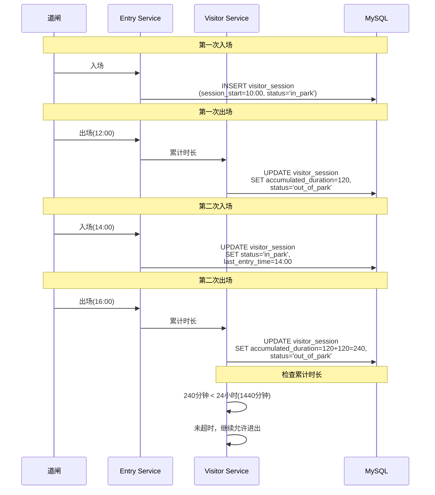
```mermaid
sequenceDiagram
    participant Gate as 道闸
    participant EntryService as Entry Service
    participant VisitorService as Visitor Service
    participant DB as MySQL
    
    Note over Gate,DB: 第一次入场
    Gate->>EntryService: 入场
    EntryService->>DB: INSERT visitor_session<br/>(session_start=10:00, status='in_park')
    
    Note over Gate,DB: 第一次出场
    Gate->>EntryService: 出场(12:00)
    EntryService->>VisitorService: 累计时长
    VisitorService->>DB: UPDATE visitor_session<br/>SET accumulated_duration=120,<br/>status='out_of_park'
    
    Note over Gate,DB: 第二次入场
    Gate->>EntryService: 入场(14:00)
    EntryService->>DB: UPDATE visitor_session<br/>SET status='in_park',<br/>last_entry_time=14:00
    
    Note over Gate,DB: 第二次出场
    Gate->>EntryService: 出场(16:00)
    EntryService->>VisitorService: 累计时长
    VisitorService->>DB: UPDATE visitor_session<br/>SET accumulated_duration=120+120=240,<br/>status='out_of_park'
    
    Note over VisitorService,DB: 检查累计时长
    VisitorService->>VisitorService: 240分钟 < 24小时(1440分钟)
    VisitorService->>VisitorService: 未超时，继续允许进出
```

### 9. Visitor 超时提醒时序图

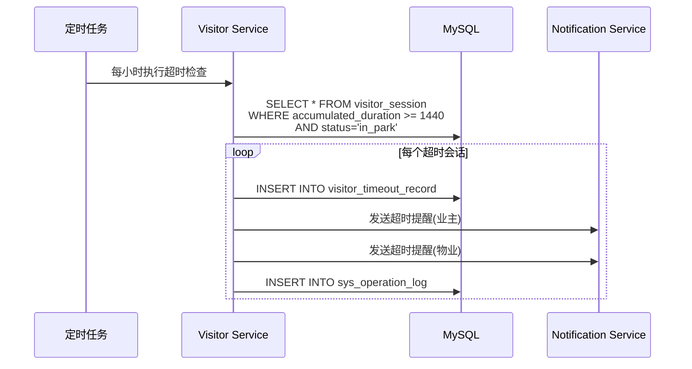
```mermaid
sequenceDiagram
    participant Scheduler as 定时任务
    participant VisitorService as Visitor Service
    participant DB as MySQL
    participant Notify as Notification Service
    
    Scheduler->>VisitorService: 每小时执行超时检查
    VisitorService->>DB: SELECT * FROM visitor_session<br/>WHERE accumulated_duration >= 1440<br/>AND status='in_park'
    
    loop 每个超时会话
        VisitorService->>DB: INSERT INTO visitor_timeout_record
        VisitorService->>Notify: 发送超时提醒(业主)
        VisitorService->>Notify: 发送超时提醒(物业)
        VisitorService->>DB: INSERT INTO sys_operation_log
    end
```

### 10. 导出审批时序图

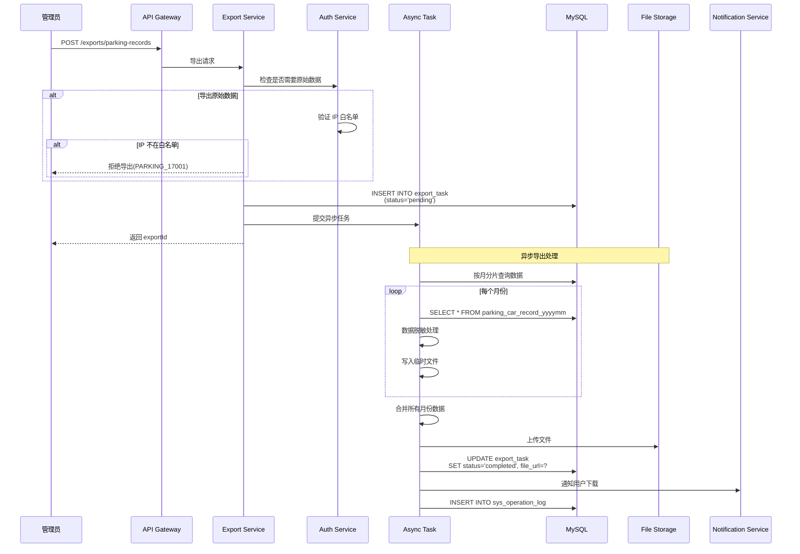
```mermaid
sequenceDiagram
    participant Admin as 管理员
    participant API as API Gateway
    participant ExportService as Export Service
    participant AuthService as Auth Service
    participant AsyncTask as Async Task
    participant DB as MySQL
    participant Storage as File Storage
    participant Notify as Notification Service
    
    Admin->>API: POST /exports/parking-records
    API->>ExportService: 导出请求
    
    ExportService->>AuthService: 检查是否需要原始数据
    alt 导出原始数据
        AuthService->>AuthService: 验证 IP 白名单
        alt IP 不在白名单
            ExportService-->>Admin: 拒绝导出(PARKING_17001)
        end
    end
    
    ExportService->>DB: INSERT INTO export_task<br/>(status='pending')
    ExportService->>AsyncTask: 提交异步任务
    ExportService-->>Admin: 返回 exportId
    
    Note over AsyncTask,Storage: 异步导出处理
    AsyncTask->>DB: 按月分片查询数据
    loop 每个月份
        AsyncTask->>DB: SELECT * FROM parking_car_record_yyyymm
        AsyncTask->>AsyncTask: 数据脱敏处理
        AsyncTask->>AsyncTask: 写入临时文件
    end
    
    AsyncTask->>AsyncTask: 合并所有月份数据
    AsyncTask->>Storage: 上传文件
    AsyncTask->>DB: UPDATE export_task<br/>SET status='completed', file_url=?
    AsyncTask->>Notify: 通知用户下载
    AsyncTask->>DB: INSERT INTO sys_operation_log
```


## State Machines

### 1. 业主审核状态机

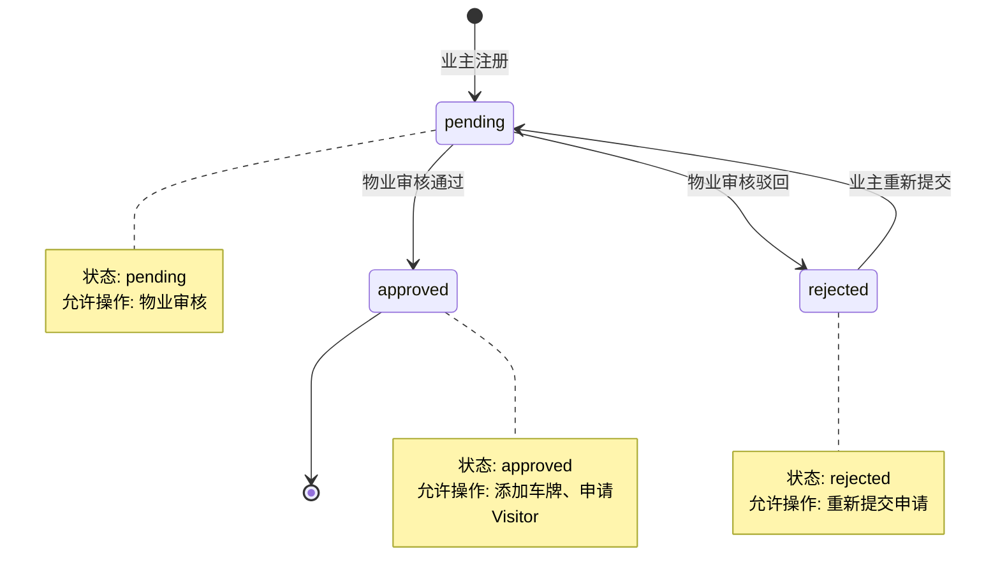
```mermaid
stateDiagram-v2
    [*] --> pending: 业主注册
    pending --> approved: 物业审核通过
    pending --> rejected: 物业审核驳回
    rejected --> pending: 业主重新提交
    approved --> [*]
    
    note right of pending
        状态: pending
        允许操作: 物业审核
    end note
    
    note right of approved
        状态: approved
        允许操作: 添加车牌、申请Visitor
    end note
    
    note right of rejected
        状态: rejected
        允许操作: 重新提交申请
    end note
```

**状态定义：**
- `pending`: 待审核，业主注册后的初始状态
- `approved`: 已通过，可以正常使用系统功能
- `rejected`: 已驳回，需要重新提交申请

**状态流转规则：**
1. 只有 `pending` 状态可以被审核
2. 审核操作必须使用幂等键防止重复
3. 状态变更必须记录 before/after 到操作日志
4. 状态变更后发送订阅消息通知业主

### 2. 账号状态机

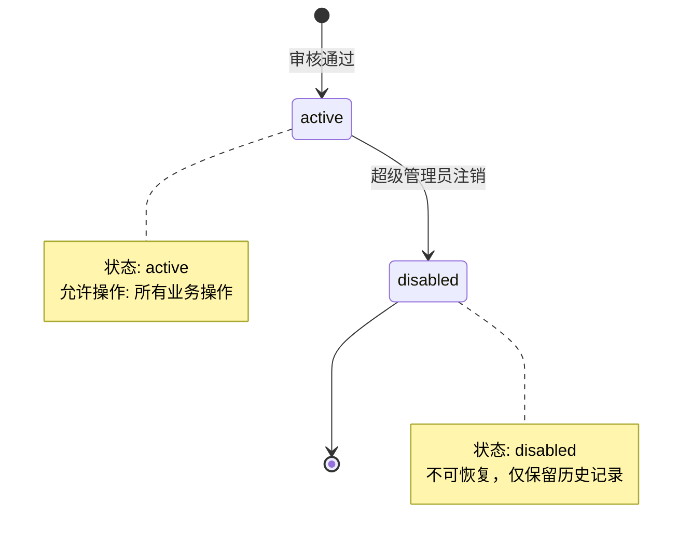
```mermaid
stateDiagram-v2
    [*] --> active: 审核通过
    active --> disabled: 超级管理员注销
    disabled --> [*]
    
    note right of active
        状态: active
        允许操作: 所有业务操作
    end note
    
    note right of disabled
        状态: disabled
        不可恢复，仅保留历史记录
    end note
```

**状态定义：**
- `active`: 正常状态，可以使用所有功能
- `disabled`: 禁用状态，账号已注销，不可恢复

**状态流转规则：**
1. 只有超级管理员可以执行注销操作
2. 注销前必须验证所有车辆均不在场
3. 注销后账号和车牌状态均设置为 `disabled`
4. 注销操作必须记录注销原因到操作日志

### 3. 车牌状态机

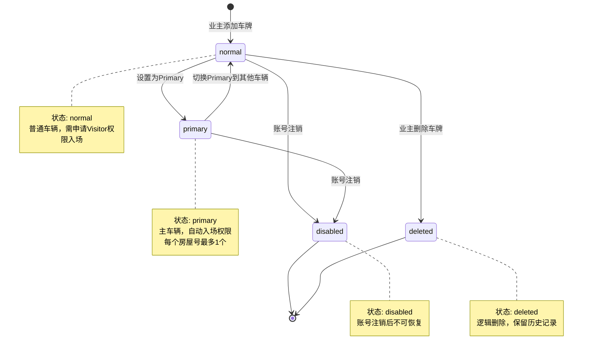
```mermaid
stateDiagram-v2
    [*] --> normal: 业主添加车牌
    normal --> primary: 设置为Primary
    primary --> normal: 切换Primary到其他车辆
    normal --> disabled: 账号注销
    primary --> disabled: 账号注销
    normal --> deleted: 业主删除车牌
    disabled --> [*]
    deleted --> [*]
    
    note right of normal
        状态: normal
        普通车辆，需申请Visitor权限入场
    end note
    
    note right of primary
        状态: primary
        主车辆，自动入场权限
        每个房屋号最多1个
    end note
    
    note right of disabled
        状态: disabled
        账号注销后不可恢复
    end note
    
    note right of deleted
        状态: deleted
        逻辑删除，保留历史记录
    end note
```

**状态定义：**
- `normal`: 普通车辆，需要申请 Visitor 权限才能入场
- `primary`: 主车辆，享受自动入场权限
- `disabled`: 禁用状态，账号注销后设置
- `deleted`: 逻辑删除，业主主动删除车牌

**状态流转规则：**
1. 设置 Primary 必须验证房屋号下所有车辆均不在场
2. 设置 Primary 必须使用行级锁和唯一索引确保 one-primary 约束
3. 删除车牌必须验证该车辆当前不在场
4. 状态变更必须记录到操作日志

### 4. 入场记录状态机

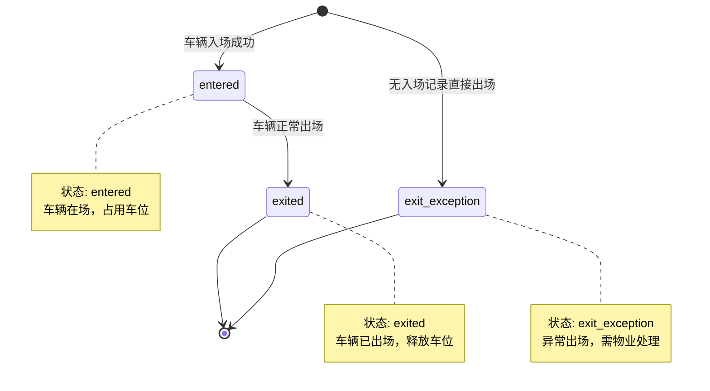
```mermaid
stateDiagram-v2
    [*] --> entered: 车辆入场成功
    entered --> exited: 车辆正常出场
    [*] --> exit_exception: 无入场记录直接出场
    exited --> [*]
    exit_exception --> [*]
    
    note right of entered
        状态: entered
        车辆在场，占用车位
    end note
    
    note right of exited
        状态: exited
        车辆已出场，释放车位
    end note
    
    note right of exit_exception
        状态: exit_exception
        异常出场，需物业处理
    end note
```

**状态定义：**
- `entered`: 已入场，车辆当前在停车场内
- `exited`: 已出场，车辆已离开停车场
- `exit_exception`: 出场异常，未找到对应的入场记录

**状态流转规则：**
1. 入场时创建记录，状态为 `entered`
2. 出场时更新状态为 `exited`，记录 exit_time
3. 无入场记录出场时创建异常记录，状态为 `exit_exception`
4. 异常出场必须通知物业管理员处理
5. 所有状态变更必须在分布式锁保护下执行

### 5. Visitor 申请/授权状态机

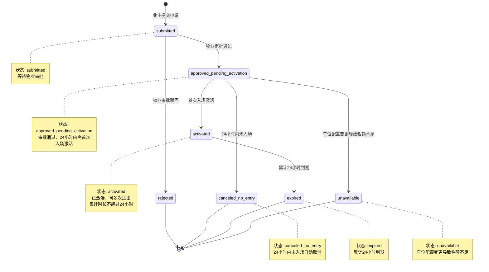
```mermaid
stateDiagram-v2
    [*] --> submitted: 业主提交申请
    submitted --> approved_pending_activation: 物业审批通过
    submitted --> rejected: 物业审批驳回
    approved_pending_activation --> activated: 首次入场激活
    approved_pending_activation --> canceled_no_entry: 24小时内未入场
    activated --> expired: 累计24小时到期
    approved_pending_activation --> unavailable: 车位配置变更导致名额不足
    rejected --> [*]
    canceled_no_entry --> [*]
    expired --> [*]
    unavailable --> [*]
    
    note right of submitted
        状态: submitted
        等待物业审批
    end note
    
    note right of approved_pending_activation
        状态: approved_pending_activation
        审批通过，24小时内需首次入场激活
    end note
    
    note right of activated
        状态: activated
        已激活，可多次进出
        累计时长不超过24小时
    end note
    
    note right of canceled_no_entry
        状态: canceled_no_entry
        24小时内未入场自动取消
    end note
    
    note right of expired
        状态: expired
        累计24小时到期
    end note
    
    note right of unavailable
        状态: unavailable
        车位配置变更导致名额不足
    end note
```

**状态定义：**
- `submitted`: 已提交，等待物业审批
- `approved_pending_activation`: 审批通过待激活，24小时内需首次入场
- `activated`: 已激活，可以多次进出，累计时长不超过24小时
- `rejected`: 已驳回，申请被拒绝
- `canceled_no_entry`: 24小时内未入场自动取消
- `expired`: 已过期，累计时长达到24小时
- `unavailable`: 不可用，车位配置变更导致名额不足

**状态流转规则：**
1. 申请时检查月度配额和 Visitor 可开放车位数
2. 审批操作必须使用幂等键防止重复
3. 首次入场时验证在24小时窗口内，激活授权
4. 激活后创建 visitor_session 记录，开始累计时长
5. 定时任务检查24小时未入场的授权，自动取消
6. 车位配置变更时，重算 Visitor 可开放车位数，更新不可用授权

### 6. Visitor 会话状态机

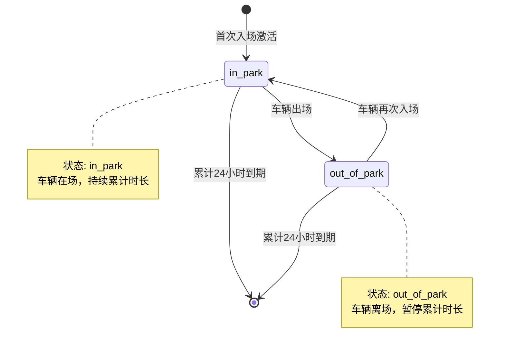
```mermaid
stateDiagram-v2
    [*] --> in_park: 首次入场激活
    in_park --> out_of_park: 车辆出场
    out_of_park --> in_park: 车辆再次入场
    in_park --> [*]: 累计24小时到期
    out_of_park --> [*]: 累计24小时到期
    
    note right of in_park
        状态: in_park
        车辆在场，持续累计时长
    end note
    
    note right of out_of_park
        状态: out_of_park
        车辆离场，暂停累计时长
    end note
```

**状态定义：**
- `in_park`: 在场，车辆当前在停车场内，持续累计时长
- `out_of_park`: 离场，车辆已离开，暂停累计时长

**状态流转规则：**
1. 首次入场时创建会话，状态为 `in_park`
2. 出场时更新状态为 `out_of_park`，累计本次停放时长
3. 再次入场时更新状态为 `in_park`，记录 last_entry_time
4. 累计时长达到24小时时，会话结束
5. 定时任务每小时检查超时会话，发送提醒

### 7. 僵尸车辆处理状态机

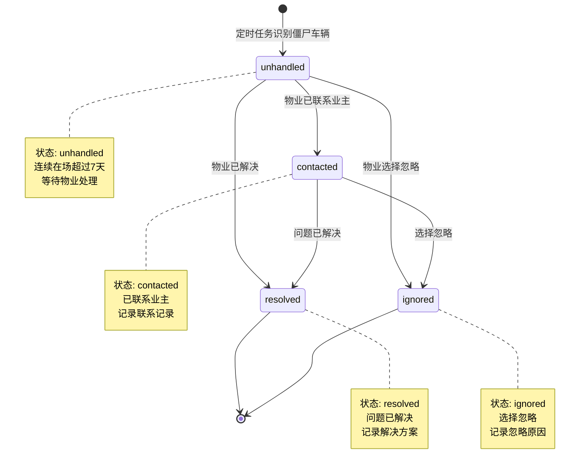
```mermaid
stateDiagram-v2
    [*] --> unhandled: 定时任务识别僵尸车辆
    unhandled --> contacted: 物业已联系业主
    unhandled --> resolved: 物业已解决
    unhandled --> ignored: 物业选择忽略
    contacted --> resolved: 问题已解决
    contacted --> ignored: 选择忽略
    resolved --> [*]
    ignored --> [*]
    
    note right of unhandled
        状态: unhandled
        连续在场超过7天
        等待物业处理
    end note
    
    note right of contacted
        状态: contacted
        已联系业主
        记录联系记录
    end note
    
    note right of resolved
        状态: resolved
        问题已解决
        记录解决方案
    end note
    
    note right of ignored
        状态: ignored
        选择忽略
        记录忽略原因
    end note
```

**状态定义：**
- `unhandled`: 未处理，定时任务识别的僵尸车辆
- `contacted`: 已联系，物业已联系业主
- `resolved`: 已解决，问题已处理完成
- `ignored`: 已忽略，物业选择不处理

**状态流转规则：**
1. 定时任务每日扫描连续在场超过7天的车辆
2. 识别到僵尸车辆时创建记录，状态为 `unhandled`
3. 物业处理时必须填写处理记录
4. 所有处理操作记录到操作日志
5. 僵尸车辆统计纳入报表


## Data Models

### 数据库设计原则

1. **命名规范**：所有表和字段使用 snake_case 命名
2. **主键规范**：所有表主键统一使用 bigint 类型，字段名统一为 id
3. **公共字段**：所有表包含 community_id、create_time、update_time
4. **逻辑删除**：所有表包含 is_deleted、deleted_time 字段
5. **索引策略**：所有表在 community_id 上建立索引，查询频繁的字段组合建立复合索引
6. **分表策略**：入场记录按月分表 parking_car_record_yyyymm
7. **分区策略**：操作日志和访问日志按月分区
8. **字符集**：统一使用 utf8mb4

### 核心表结构

#### 1. sys_community (小区表)

```sql
CREATE TABLE sys_community (
    id BIGINT PRIMARY KEY AUTO_INCREMENT COMMENT '小区ID',
    community_name VARCHAR(100) NOT NULL COMMENT '小区名称',
    community_code VARCHAR(50) NOT NULL UNIQUE COMMENT '小区编码',
    province VARCHAR(50) NOT NULL COMMENT '省份',
    city VARCHAR(50) NOT NULL COMMENT '城市',
    district VARCHAR(50) NOT NULL COMMENT '区县',
    address VARCHAR(200) NOT NULL COMMENT '详细地址',
    contact_person VARCHAR(50) COMMENT '联系人',
    contact_phone VARCHAR(20) COMMENT '联系电话',
    status VARCHAR(20) NOT NULL DEFAULT 'active' COMMENT '状态: active-正常, disabled-禁用',
    create_time DATETIME NOT NULL DEFAULT CURRENT_TIMESTAMP COMMENT '创建时间',
    update_time DATETIME NOT NULL DEFAULT CURRENT_TIMESTAMP ON UPDATE CURRENT_TIMESTAMP COMMENT '更新时间',
    is_deleted TINYINT NOT NULL DEFAULT 0 COMMENT '是否删除: 0-否, 1-是',
    deleted_time DATETIME COMMENT '删除时间',
    INDEX idx_community_code (community_code),
    INDEX idx_status (status)
) ENGINE=InnoDB DEFAULT CHARSET=utf8mb4 COMMENT='小区表';
```

#### 2. sys_admin (管理员表)

```sql
CREATE TABLE sys_admin (
    id BIGINT PRIMARY KEY AUTO_INCREMENT COMMENT '管理员ID',
    community_id BIGINT NOT NULL COMMENT '小区ID, 0表示超级管理员',
    username VARCHAR(50) NOT NULL UNIQUE COMMENT '用户名',
    password VARCHAR(100) NOT NULL COMMENT '密码(BCrypt加密)',
    real_name VARCHAR(50) NOT NULL COMMENT '真实姓名',
    phone_number VARCHAR(20) NOT NULL COMMENT '手机号',
    role VARCHAR(20) NOT NULL COMMENT '角色: super_admin-超级管理员, property_admin-物业管理员',
    status VARCHAR(20) NOT NULL DEFAULT 'active' COMMENT '状态: active-正常, locked-锁定, disabled-禁用',
    login_fail_count INT NOT NULL DEFAULT 0 COMMENT '登录失败次数',
    last_login_time DATETIME COMMENT '最后登录时间',
    last_login_ip VARCHAR(50) COMMENT '最后登录IP',
    password_expire_time DATETIME COMMENT '密码过期时间',
    must_change_password TINYINT NOT NULL DEFAULT 0 COMMENT '是否必须修改密码: 0-否, 1-是',
    create_time DATETIME NOT NULL DEFAULT CURRENT_TIMESTAMP COMMENT '创建时间',
    update_time DATETIME NOT NULL DEFAULT CURRENT_TIMESTAMP ON UPDATE CURRENT_TIMESTAMP COMMENT '更新时间',
    is_deleted TINYINT NOT NULL DEFAULT 0 COMMENT '是否删除: 0-否, 1-是',
    deleted_time DATETIME COMMENT '删除时间',
    INDEX idx_community_id (community_id),
    INDEX idx_username (username),
    INDEX idx_phone_number (phone_number),
    INDEX idx_role (role)
) ENGINE=InnoDB DEFAULT CHARSET=utf8mb4 COMMENT='管理员表';
```

#### 3. sys_owner (业主表)

```sql
CREATE TABLE sys_owner (
    id BIGINT PRIMARY KEY AUTO_INCREMENT COMMENT '业主ID',
    community_id BIGINT NOT NULL COMMENT '小区ID',
    house_no VARCHAR(50) NOT NULL COMMENT '房屋号',
    phone_number VARCHAR(20) NOT NULL COMMENT '手机号',
    id_card_last4 VARCHAR(4) NOT NULL COMMENT '身份证后4位',
    real_name VARCHAR(50) COMMENT '真实姓名',
    status VARCHAR(30) NOT NULL DEFAULT 'pending' COMMENT '状态: pending-待审核, approved-已通过, rejected-已驳回',
    reject_reason TEXT COMMENT '驳回原因',
    audit_admin_id BIGINT COMMENT '审核管理员ID',
    audit_time DATETIME COMMENT '审核时间',
    account_status VARCHAR(20) NOT NULL DEFAULT 'active' COMMENT '账号状态: active-正常, disabled-禁用',
    create_time DATETIME NOT NULL DEFAULT CURRENT_TIMESTAMP COMMENT '创建时间',
    update_time DATETIME NOT NULL DEFAULT CURRENT_TIMESTAMP ON UPDATE CURRENT_TIMESTAMP COMMENT '更新时间',
    is_deleted TINYINT NOT NULL DEFAULT 0 COMMENT '是否删除: 0-否, 1-是',
    deleted_time DATETIME COMMENT '删除时间',
    INDEX idx_community_house (community_id, house_no),
    INDEX idx_phone_number (phone_number),
    INDEX idx_status (status),
    INDEX idx_account_status (account_status)
) ENGINE=InnoDB DEFAULT CHARSET=utf8mb4 COMMENT='业主表';
```

#### 4. sys_house (房屋号表)

```sql
CREATE TABLE sys_house (
    id BIGINT PRIMARY KEY AUTO_INCREMENT COMMENT '房屋ID',
    community_id BIGINT NOT NULL COMMENT '小区ID',
    house_no VARCHAR(50) NOT NULL COMMENT '房屋号',
    building VARCHAR(50) NOT NULL COMMENT '楼栋',
    unit VARCHAR(50) COMMENT '单元',
    floor VARCHAR(20) COMMENT '楼层',
    room VARCHAR(20) COMMENT '房间号',
    area DECIMAL(10,2) COMMENT '面积(平方米)',
    status VARCHAR(20) NOT NULL DEFAULT 'normal' COMMENT '状态: normal-正常, disabled-禁用',
    create_time DATETIME NOT NULL DEFAULT CURRENT_TIMESTAMP COMMENT '创建时间',
    update_time DATETIME NOT NULL DEFAULT CURRENT_TIMESTAMP ON UPDATE CURRENT_TIMESTAMP COMMENT '更新时间',
    is_deleted TINYINT NOT NULL DEFAULT 0 COMMENT '是否删除: 0-否, 1-是',
    deleted_time DATETIME COMMENT '删除时间',
    UNIQUE KEY uk_community_house (community_id, house_no),
    INDEX idx_building (community_id, building)
) ENGINE=InnoDB DEFAULT CHARSET=utf8mb4 COMMENT='房屋号表';
```

#### 5. sys_owner_house_rel (业主房屋号关联表)

```sql
CREATE TABLE sys_owner_house_rel (
    id BIGINT PRIMARY KEY AUTO_INCREMENT COMMENT '关联ID',
    community_id BIGINT NOT NULL COMMENT '小区ID',
    owner_id BIGINT NOT NULL COMMENT '业主ID',
    house_no VARCHAR(50) NOT NULL COMMENT '房屋号',
    relation_type VARCHAR(20) NOT NULL COMMENT '关系类型: owner-业主, family-家属, tenant-租户',
    create_time DATETIME NOT NULL DEFAULT CURRENT_TIMESTAMP COMMENT '创建时间',
    update_time DATETIME NOT NULL DEFAULT CURRENT_TIMESTAMP ON UPDATE CURRENT_TIMESTAMP COMMENT '更新时间',
    is_deleted TINYINT NOT NULL DEFAULT 0 COMMENT '是否删除: 0-否, 1-是',
    deleted_time DATETIME COMMENT '删除时间',
    INDEX idx_owner (owner_id),
    INDEX idx_community_house (community_id, house_no)
) ENGINE=InnoDB DEFAULT CHARSET=utf8mb4 COMMENT='业主房屋号关联表';
```

#### 6. sys_car_plate (车牌表)

```sql
CREATE TABLE sys_car_plate (
    id BIGINT PRIMARY KEY AUTO_INCREMENT COMMENT '车牌ID',
    community_id BIGINT NOT NULL COMMENT '小区ID',
    house_no VARCHAR(50) NOT NULL COMMENT '房屋号',
    owner_id BIGINT NOT NULL COMMENT '业主ID',
    car_number VARCHAR(20) NOT NULL COMMENT '车牌号',
    car_brand VARCHAR(50) COMMENT '车辆品牌',
    car_model VARCHAR(50) COMMENT '车辆型号',
    car_color VARCHAR(20) COMMENT '车辆颜色',
    status VARCHAR(20) NOT NULL DEFAULT 'normal' COMMENT '状态: normal-普通, primary-主车辆, disabled-禁用, deleted-已删除',
    create_time DATETIME NOT NULL DEFAULT CURRENT_TIMESTAMP COMMENT '创建时间',
    update_time DATETIME NOT NULL DEFAULT CURRENT_TIMESTAMP ON UPDATE CURRENT_TIMESTAMP COMMENT '更新时间',
    is_deleted TINYINT NOT NULL DEFAULT 0 COMMENT '是否删除: 0-否, 1-是',
    deleted_time DATETIME COMMENT '删除时间',
    UNIQUE KEY uk_community_car (community_id, car_number, is_deleted),
    UNIQUE KEY uk_community_house_primary (community_id, house_no, status) COMMENT 'Primary车辆唯一约束',
    INDEX idx_owner (owner_id),
    INDEX idx_community_house (community_id, house_no),
    INDEX idx_status (status)
) ENGINE=InnoDB DEFAULT CHARSET=utf8mb4 COMMENT='车牌表';
```

**说明：**
- `uk_community_house_primary` 唯一索引确保每个房屋号最多只有1个 Primary 车辆
- 该索引仅在 status='primary' 时生效，通过部分索引实现

#### 7. parking_config (停车场配置表)

```sql
CREATE TABLE parking_config (
    id BIGINT PRIMARY KEY AUTO_INCREMENT COMMENT '配置ID',
    community_id BIGINT NOT NULL UNIQUE COMMENT '小区ID',
    total_spaces INT NOT NULL COMMENT '总车位数',
    reserved_spaces INT NOT NULL DEFAULT 0 COMMENT '预留车位数',
    visitor_quota_hours INT NOT NULL DEFAULT 72 COMMENT '月度Visitor配额(小时)',
    visitor_single_duration_hours INT NOT NULL DEFAULT 24 COMMENT '单次Visitor时长限制(小时)',
    visitor_activation_window_hours INT NOT NULL DEFAULT 24 COMMENT 'Visitor激活窗口(小时)',
    zombie_vehicle_threshold_days INT NOT NULL DEFAULT 7 COMMENT '僵尸车辆阈值(天)',
    version INT NOT NULL DEFAULT 0 COMMENT '版本号(乐观锁)',
    create_time DATETIME NOT NULL DEFAULT CURRENT_TIMESTAMP COMMENT '创建时间',
    update_time DATETIME NOT NULL DEFAULT CURRENT_TIMESTAMP ON UPDATE CURRENT_TIMESTAMP COMMENT '更新时间',
    INDEX idx_community_id (community_id)
) ENGINE=InnoDB DEFAULT CHARSET=utf8mb4 COMMENT='停车场配置表';
```

#### 8. parking_car_record_yyyymm (入场记录分表)

```sql
CREATE TABLE parking_car_record_202401 (
    id BIGINT PRIMARY KEY AUTO_INCREMENT COMMENT '记录ID',
    community_id BIGINT NOT NULL COMMENT '小区ID',
    house_no VARCHAR(50) NOT NULL COMMENT '房屋号',
    car_number VARCHAR(20) NOT NULL COMMENT '车牌号',
    vehicle_type VARCHAR(20) NOT NULL COMMENT '车辆类型: primary-主车辆, visitor-访客车辆',
    enter_time DATETIME NOT NULL COMMENT '入场时间',
    exit_time DATETIME COMMENT '出场时间',
    duration INT COMMENT '停放时长(分钟)',
    status VARCHAR(30) NOT NULL COMMENT '状态: entered-已入场, exited-已出场, exit_exception-出场异常',
    exception_reason TEXT COMMENT '异常原因',
    handler_admin_id BIGINT COMMENT '处理管理员ID',
    handle_time DATETIME COMMENT '处理时间',
    handle_remark TEXT COMMENT '处理备注',
    create_time DATETIME NOT NULL DEFAULT CURRENT_TIMESTAMP COMMENT '创建时间',
    update_time DATETIME NOT NULL DEFAULT CURRENT_TIMESTAMP ON UPDATE CURRENT_TIMESTAMP COMMENT '更新时间',
    INDEX idx_community_enter_time (community_id, enter_time),
    INDEX idx_community_car_enter (community_id, car_number, enter_time),
    INDEX idx_community_house_enter (community_id, house_no, enter_time),
    INDEX idx_community_status_enter (community_id, status, enter_time),
    INDEX idx_status (status)
) ENGINE=InnoDB DEFAULT CHARSET=utf8mb4 COMMENT='入场记录表-2024年1月';
```

**说明：**
- 按月分表，表名格式为 parking_car_record_yyyymm
- 提前创建未来3个月的分表
- 定时任务自动创建新月份分表

#### 9. visitor_application (Visitor申请表)

```sql
CREATE TABLE visitor_application (
    id BIGINT PRIMARY KEY AUTO_INCREMENT COMMENT '申请ID',
    community_id BIGINT NOT NULL COMMENT '小区ID',
    house_no VARCHAR(50) NOT NULL COMMENT '房屋号',
    owner_id BIGINT NOT NULL COMMENT '申请业主ID',
    car_plate_id BIGINT NOT NULL COMMENT '车牌ID',
    car_number VARCHAR(20) NOT NULL COMMENT '车牌号',
    apply_reason TEXT COMMENT '申请原因',
    status VARCHAR(30) NOT NULL DEFAULT 'submitted' COMMENT '状态: submitted-已提交, approved_pending_activation-审批通过待激活, rejected-已驳回',
    reject_reason TEXT COMMENT '驳回原因',
    audit_admin_id BIGINT COMMENT '审批管理员ID',
    audit_time DATETIME COMMENT '审批时间',
    create_time DATETIME NOT NULL DEFAULT CURRENT_TIMESTAMP COMMENT '创建时间',
    update_time DATETIME NOT NULL DEFAULT CURRENT_TIMESTAMP ON UPDATE CURRENT_TIMESTAMP COMMENT '更新时间',
    is_deleted TINYINT NOT NULL DEFAULT 0 COMMENT '是否删除: 0-否, 1-是',
    deleted_time DATETIME COMMENT '删除时间',
    INDEX idx_community_house (community_id, house_no),
    INDEX idx_owner (owner_id),
    INDEX idx_status (status),
    INDEX idx_create_time (create_time)
) ENGINE=InnoDB DEFAULT CHARSET=utf8mb4 COMMENT='Visitor申请表';
```

#### 10. visitor_authorization (Visitor授权表)

```sql
CREATE TABLE visitor_authorization (
    id BIGINT PRIMARY KEY AUTO_INCREMENT COMMENT '授权ID',
    community_id BIGINT NOT NULL COMMENT '小区ID',
    house_no VARCHAR(50) NOT NULL COMMENT '房屋号',
    application_id BIGINT NOT NULL COMMENT '申请ID',
    car_plate_id BIGINT NOT NULL COMMENT '车牌ID',
    car_number VARCHAR(20) NOT NULL COMMENT '车牌号',
    status VARCHAR(30) NOT NULL COMMENT '状态: approved_pending_activation-待激活, activated-已激活, canceled_no_entry-未入场取消, expired-已过期, unavailable-不可用',
    start_time DATETIME NOT NULL COMMENT '授权开始时间',
    expire_time DATETIME NOT NULL COMMENT '授权过期时间(24小时激活窗口)',
    activation_time DATETIME COMMENT '激活时间(首次入场时间)',
    create_time DATETIME NOT NULL DEFAULT CURRENT_TIMESTAMP COMMENT '创建时间',
    update_time DATETIME NOT NULL DEFAULT CURRENT_TIMESTAMP ON UPDATE CURRENT_TIMESTAMP COMMENT '更新时间',
    is_deleted TINYINT NOT NULL DEFAULT 0 COMMENT '是否删除: 0-否, 1-是',
    deleted_time DATETIME COMMENT '删除时间',
    INDEX idx_community_car (community_id, car_number),
    INDEX idx_status (status),
    INDEX idx_expire_time (expire_time),
    INDEX idx_application (application_id)
) ENGINE=InnoDB DEFAULT CHARSET=utf8mb4 COMMENT='Visitor授权表';
```

#### 11. visitor_session (Visitor会话表)

```sql
CREATE TABLE visitor_session (
    id BIGINT PRIMARY KEY AUTO_INCREMENT COMMENT '会话ID',
    community_id BIGINT NOT NULL COMMENT '小区ID',
    house_no VARCHAR(50) NOT NULL COMMENT '房屋号',
    authorization_id BIGINT NOT NULL COMMENT '授权ID',
    car_number VARCHAR(20) NOT NULL COMMENT '车牌号',
    session_start DATETIME NOT NULL COMMENT '会话开始时间(首次入场时间)',
    last_entry_time DATETIME COMMENT '最后一次入场时间',
    accumulated_duration INT NOT NULL DEFAULT 0 COMMENT '累计停放时长(分钟)',
    status VARCHAR(20) NOT NULL COMMENT '状态: in_park-在场, out_of_park-离场',
    timeout_notified TINYINT NOT NULL DEFAULT 0 COMMENT '是否已发送超时提醒: 0-否, 1-是',
    create_time DATETIME NOT NULL DEFAULT CURRENT_TIMESTAMP COMMENT '创建时间',
    update_time DATETIME NOT NULL DEFAULT CURRENT_TIMESTAMP ON UPDATE CURRENT_TIMESTAMP COMMENT '更新时间',
    INDEX idx_authorization (authorization_id),
    INDEX idx_community_house (community_id, house_no),
    INDEX idx_status (status),
    INDEX idx_accumulated_duration (accumulated_duration)
) ENGINE=InnoDB DEFAULT CHARSET=utf8mb4 COMMENT='Visitor会话表';
```

#### 12. parking_stat_daily (每日统计预聚合表)

```sql
CREATE TABLE parking_stat_daily (
    id BIGINT PRIMARY KEY AUTO_INCREMENT COMMENT '统计ID',
    community_id BIGINT NOT NULL COMMENT '小区ID',
    stat_date DATE NOT NULL COMMENT '统计日期',
    total_entry_count INT NOT NULL DEFAULT 0 COMMENT '当日入场总数',
    total_exit_count INT NOT NULL DEFAULT 0 COMMENT '当日出场总数',
    primary_entry_count INT NOT NULL DEFAULT 0 COMMENT 'Primary车辆入场数',
    visitor_entry_count INT NOT NULL DEFAULT 0 COMMENT 'Visitor车辆入场数',
    peak_hour INT COMMENT '峰值时段(小时)',
    peak_count INT COMMENT '峰值时段车辆数',
    avg_parking_duration INT COMMENT '平均停放时长(分钟)',
    zombie_vehicle_count INT NOT NULL DEFAULT 0 COMMENT '僵尸车辆数',
    exception_exit_count INT NOT NULL DEFAULT 0 COMMENT '异常出场数',
    create_time DATETIME NOT NULL DEFAULT CURRENT_TIMESTAMP COMMENT '创建时间',
    update_time DATETIME NOT NULL DEFAULT CURRENT_TIMESTAMP ON UPDATE CURRENT_TIMESTAMP COMMENT '更新时间',
    UNIQUE KEY uk_community_date (community_id, stat_date),
    INDEX idx_stat_date (stat_date)
) ENGINE=InnoDB DEFAULT CHARSET=utf8mb4 COMMENT='每日统计预聚合表';
```


#### 13. sys_operation_log (操作日志表)

```sql
CREATE TABLE sys_operation_log (
    id BIGINT PRIMARY KEY AUTO_INCREMENT COMMENT '日志ID',
    request_id VARCHAR(100) NOT NULL COMMENT '请求唯一标识',
    community_id BIGINT NOT NULL COMMENT '小区ID',
    operator_id BIGINT NOT NULL COMMENT '操作人ID',
    operator_name VARCHAR(50) NOT NULL COMMENT '操作人姓名',
    operator_role VARCHAR(20) NOT NULL COMMENT '操作人角色',
    operator_ip VARCHAR(50) NOT NULL COMMENT '操作人IP',
    operation_type VARCHAR(50) NOT NULL COMMENT '操作类型',
    operation_time DATETIME NOT NULL COMMENT '操作时间',
    target_type VARCHAR(50) NOT NULL COMMENT '目标类型',
    target_id BIGINT COMMENT '目标ID',
    before_value TEXT COMMENT '操作前值(JSON)',
    after_value TEXT COMMENT '操作后值(JSON)',
    operation_result VARCHAR(20) NOT NULL COMMENT '操作结果: success-成功, failure-失败',
    error_message TEXT COMMENT '错误信息',
    create_time DATETIME NOT NULL DEFAULT CURRENT_TIMESTAMP COMMENT '创建时间',
    INDEX idx_request_id (request_id),
    INDEX idx_community_id (community_id),
    INDEX idx_operator_id (operator_id),
    INDEX idx_operation_type (operation_type),
    INDEX idx_operation_time (operation_time),
    INDEX idx_target (target_type, target_id)
) ENGINE=InnoDB DEFAULT CHARSET=utf8mb4 COMMENT='操作日志表'
PARTITION BY RANGE (TO_DAYS(operation_time)) (
    PARTITION p202401 VALUES LESS THAN (TO_DAYS('2024-02-01')),
    PARTITION p202402 VALUES LESS THAN (TO_DAYS('2024-03-01')),
    PARTITION p202403 VALUES LESS THAN (TO_DAYS('2024-04-01')),
    PARTITION pmax VALUES LESS THAN MAXVALUE
);
```

**说明：**
- 按月分区存储
- 永久保留，不可删除、不可篡改
- 6个月后归档到只读库

#### 14. sys_access_log (访问日志表)

```sql
CREATE TABLE sys_access_log (
    id BIGINT PRIMARY KEY AUTO_INCREMENT COMMENT '日志ID',
    request_id VARCHAR(100) NOT NULL COMMENT '请求唯一标识',
    community_id BIGINT COMMENT '小区ID',
    user_id BIGINT COMMENT '访问人ID',
    user_name VARCHAR(50) COMMENT '访问人姓名',
    user_role VARCHAR(20) COMMENT '访问人角色',
    user_ip VARCHAR(50) NOT NULL COMMENT '访问人IP',
    access_time DATETIME NOT NULL COMMENT '访问时间',
    api_path VARCHAR(200) NOT NULL COMMENT '接口路径',
    http_method VARCHAR(10) NOT NULL COMMENT 'HTTP方法',
    query_params TEXT COMMENT '查询参数(JSON)',
    request_body TEXT COMMENT '请求体(JSON)',
    response_code INT NOT NULL COMMENT '响应码',
    response_time INT NOT NULL COMMENT '响应时间(毫秒)',
    user_agent VARCHAR(500) COMMENT 'User-Agent',
    create_time DATETIME NOT NULL DEFAULT CURRENT_TIMESTAMP COMMENT '创建时间',
    INDEX idx_request_id (request_id),
    INDEX idx_community_id (community_id),
    INDEX idx_user_id (user_id),
    INDEX idx_access_time (access_time),
    INDEX idx_api_path (api_path),
    INDEX idx_response_time (response_time)
) ENGINE=InnoDB DEFAULT CHARSET=utf8mb4 COMMENT='访问日志表'
PARTITION BY RANGE (TO_DAYS(access_time)) (
    PARTITION p202401 VALUES LESS THAN (TO_DAYS('2024-02-01')),
    PARTITION p202402 VALUES LESS THAN (TO_DAYS('2024-03-01')),
    PARTITION p202403 VALUES LESS THAN (TO_DAYS('2024-04-01')),
    PARTITION pmax VALUES LESS THAN MAXVALUE
);
```

**说明：**
- 按月分区存储
- 永久保留，不可删除、不可篡改
- 6个月后归档到只读库

#### 15. sys_ip_whitelist (IP白名单表)

```sql
CREATE TABLE sys_ip_whitelist (
    id BIGINT PRIMARY KEY AUTO_INCREMENT COMMENT '白名单ID',
    community_id BIGINT NOT NULL COMMENT '小区ID, 0表示全局',
    ip_address VARCHAR(50) NOT NULL COMMENT 'IP地址',
    ip_range VARCHAR(100) COMMENT 'IP段(CIDR格式)',
    operation_type VARCHAR(50) NOT NULL COMMENT '操作类型: export_raw_data-导出原始数据, modify_config-修改配置, disable_account-注销账号',
    description VARCHAR(200) COMMENT '描述',
    status VARCHAR(20) NOT NULL DEFAULT 'active' COMMENT '状态: active-启用, disabled-禁用',
    create_admin_id BIGINT NOT NULL COMMENT '创建管理员ID',
    create_time DATETIME NOT NULL DEFAULT CURRENT_TIMESTAMP COMMENT '创建时间',
    update_time DATETIME NOT NULL DEFAULT CURRENT_TIMESTAMP ON UPDATE CURRENT_TIMESTAMP COMMENT '更新时间',
    is_deleted TINYINT NOT NULL DEFAULT 0 COMMENT '是否删除: 0-否, 1-是',
    deleted_time DATETIME COMMENT '删除时间',
    INDEX idx_community_id (community_id),
    INDEX idx_ip_address (ip_address),
    INDEX idx_operation_type (operation_type),
    INDEX idx_status (status)
) ENGINE=InnoDB DEFAULT CHARSET=utf8mb4 COMMENT='IP白名单表';
```

#### 16. zombie_vehicle (僵尸车辆表)

```sql
CREATE TABLE zombie_vehicle (
    id BIGINT PRIMARY KEY AUTO_INCREMENT COMMENT '僵尸车辆ID',
    community_id BIGINT NOT NULL COMMENT '小区ID',
    house_no VARCHAR(50) NOT NULL COMMENT '房屋号',
    car_number VARCHAR(20) NOT NULL COMMENT '车牌号',
    entry_record_id BIGINT NOT NULL COMMENT '入场记录ID',
    enter_time DATETIME NOT NULL COMMENT '入场时间',
    continuous_days INT NOT NULL COMMENT '连续在场天数',
    status VARCHAR(20) NOT NULL DEFAULT 'unhandled' COMMENT '状态: unhandled-未处理, contacted-已联系, resolved-已解决, ignored-已忽略',
    contact_record TEXT COMMENT '联系记录',
    solution TEXT COMMENT '解决方案',
    ignore_reason TEXT COMMENT '忽略原因',
    handler_admin_id BIGINT COMMENT '处理管理员ID',
    handle_time DATETIME COMMENT '处理时间',
    create_time DATETIME NOT NULL DEFAULT CURRENT_TIMESTAMP COMMENT '创建时间',
    update_time DATETIME NOT NULL DEFAULT CURRENT_TIMESTAMP ON UPDATE CURRENT_TIMESTAMP COMMENT '更新时间',
    INDEX idx_community_id (community_id),
    INDEX idx_car_number (car_number),
    INDEX idx_status (status),
    INDEX idx_continuous_days (continuous_days)
) ENGINE=InnoDB DEFAULT CHARSET=utf8mb4 COMMENT='僵尸车辆表';
```

#### 17. owner_info_modify_application (敏感信息修改申请表)

```sql
CREATE TABLE owner_info_modify_application (
    id BIGINT PRIMARY KEY AUTO_INCREMENT COMMENT '申请ID',
    community_id BIGINT NOT NULL COMMENT '小区ID',
    owner_id BIGINT NOT NULL COMMENT '业主ID',
    modify_type VARCHAR(20) NOT NULL COMMENT '修改类型: phone-手机号, id_card-身份证',
    old_value VARCHAR(100) NOT NULL COMMENT '原值(加密)',
    new_value VARCHAR(100) NOT NULL COMMENT '新值(加密)',
    apply_reason TEXT COMMENT '申请原因',
    status VARCHAR(20) NOT NULL DEFAULT 'pending' COMMENT '状态: pending-待审核, approved-已通过, rejected-已驳回',
    reject_reason TEXT COMMENT '驳回原因',
    audit_admin_id BIGINT COMMENT '审批管理员ID',
    audit_time DATETIME COMMENT '审批时间',
    create_time DATETIME NOT NULL DEFAULT CURRENT_TIMESTAMP COMMENT '创建时间',
    update_time DATETIME NOT NULL DEFAULT CURRENT_TIMESTAMP ON UPDATE CURRENT_TIMESTAMP COMMENT '更新时间',
    is_deleted TINYINT NOT NULL DEFAULT 0 COMMENT '是否删除: 0-否, 1-是',
    deleted_time DATETIME COMMENT '删除时间',
    INDEX idx_owner (owner_id),
    INDEX idx_status (status),
    INDEX idx_create_time (create_time)
) ENGINE=InnoDB DEFAULT CHARSET=utf8mb4 COMMENT='敏感信息修改申请表';
```

#### 18. export_task (导出任务表)

```sql
CREATE TABLE export_task (
    id BIGINT PRIMARY KEY AUTO_INCREMENT COMMENT '任务ID',
    community_id BIGINT NOT NULL COMMENT '小区ID',
    export_type VARCHAR(50) NOT NULL COMMENT '导出类型: parking_records-入场记录, audit_logs-审计日志',
    operator_id BIGINT NOT NULL COMMENT '操作人ID',
    operator_name VARCHAR(50) NOT NULL COMMENT '操作人姓名',
    query_params TEXT NOT NULL COMMENT '查询参数(JSON)',
    need_raw_data TINYINT NOT NULL DEFAULT 0 COMMENT '是否需要原始数据: 0-否, 1-是',
    status VARCHAR(20) NOT NULL DEFAULT 'pending' COMMENT '状态: pending-待处理, processing-处理中, completed-已完成, failed-失败',
    file_url VARCHAR(500) COMMENT '文件下载地址',
    file_size BIGINT COMMENT '文件大小(字节)',
    record_count INT COMMENT '记录数量',
    error_message TEXT COMMENT '错误信息',
    start_time DATETIME COMMENT '开始时间',
    end_time DATETIME COMMENT '结束时间',
    expire_time DATETIME COMMENT '文件过期时间',
    create_time DATETIME NOT NULL DEFAULT CURRENT_TIMESTAMP COMMENT '创建时间',
    update_time DATETIME NOT NULL DEFAULT CURRENT_TIMESTAMP ON UPDATE CURRENT_TIMESTAMP COMMENT '更新时间',
    INDEX idx_community_id (community_id),
    INDEX idx_operator_id (operator_id),
    INDEX idx_status (status),
    INDEX idx_create_time (create_time)
) ENGINE=InnoDB DEFAULT CHARSET=utf8mb4 COMMENT='导出任务表';
```

#### 19. verification_code (验证码表)

```sql
CREATE TABLE verification_code (
    id BIGINT PRIMARY KEY AUTO_INCREMENT COMMENT '验证码ID',
    phone_number VARCHAR(20) NOT NULL COMMENT '手机号',
    code VARCHAR(10) NOT NULL COMMENT '验证码',
    code_type VARCHAR(20) NOT NULL COMMENT '验证码类型: register-注册, login-登录, modify-修改信息',
    fail_count INT NOT NULL DEFAULT 0 COMMENT '验证失败次数',
    status VARCHAR(20) NOT NULL DEFAULT 'active' COMMENT '状态: active-有效, used-已使用, expired-已过期, locked-已锁定',
    expire_time DATETIME NOT NULL COMMENT '过期时间',
    create_time DATETIME NOT NULL DEFAULT CURRENT_TIMESTAMP COMMENT '创建时间',
    update_time DATETIME NOT NULL DEFAULT CURRENT_TIMESTAMP ON UPDATE CURRENT_TIMESTAMP COMMENT '更新时间',
    INDEX idx_phone_number (phone_number),
    INDEX idx_expire_time (expire_time)
) ENGINE=InnoDB DEFAULT CHARSET=utf8mb4 COMMENT='验证码表';
```

#### 20. hardware_device (硬件设备表 - 预留)

```sql
CREATE TABLE hardware_device (
    id BIGINT PRIMARY KEY AUTO_INCREMENT COMMENT '设备ID',
    community_id BIGINT NOT NULL COMMENT '小区ID',
    device_type VARCHAR(20) NOT NULL COMMENT '设备类型: gate-道闸, camera-车牌识别',
    device_code VARCHAR(50) NOT NULL UNIQUE COMMENT '设备编码',
    device_name VARCHAR(100) NOT NULL COMMENT '设备名称',
    location VARCHAR(200) COMMENT '设备位置',
    ip_address VARCHAR(50) COMMENT 'IP地址',
    secret_key VARCHAR(100) NOT NULL COMMENT '签名密钥',
    status VARCHAR(20) NOT NULL DEFAULT 'active' COMMENT '状态: active-正常, offline-离线, disabled-禁用',
    last_heartbeat_time DATETIME COMMENT '最后心跳时间',
    create_time DATETIME NOT NULL DEFAULT CURRENT_TIMESTAMP COMMENT '创建时间',
    update_time DATETIME NOT NULL DEFAULT CURRENT_TIMESTAMP ON UPDATE CURRENT_TIMESTAMP COMMENT '更新时间',
    is_deleted TINYINT NOT NULL DEFAULT 0 COMMENT '是否删除: 0-否, 1-是',
    deleted_time DATETIME COMMENT '删除时间',
    INDEX idx_community_id (community_id),
    INDEX idx_device_code (device_code),
    INDEX idx_device_type (device_type)
) ENGINE=InnoDB DEFAULT CHARSET=utf8mb4 COMMENT='硬件设备表';
```

#### 21. parking_fee (停车费用表 - 预留)

```sql
CREATE TABLE parking_fee (
    id BIGINT PRIMARY KEY AUTO_INCREMENT COMMENT '费用ID',
    community_id BIGINT NOT NULL COMMENT '小区ID',
    house_no VARCHAR(50) NOT NULL COMMENT '房屋号',
    car_number VARCHAR(20) NOT NULL COMMENT '车牌号',
    entry_record_id BIGINT NOT NULL COMMENT '入场记录ID',
    fee_amount DECIMAL(10,2) NOT NULL COMMENT '费用金额',
    fee_type VARCHAR(20) NOT NULL COMMENT '费用类型: parking-停车费, overtime-超时费',
    payment_status VARCHAR(20) NOT NULL DEFAULT 'unpaid' COMMENT '支付状态: unpaid-未支付, paid-已支付, refunded-已退款',
    payment_method VARCHAR(20) COMMENT '支付方式: wechat-微信, alipay-支付宝',
    payment_time DATETIME COMMENT '支付时间',
    transaction_id VARCHAR(100) COMMENT '交易流水号',
    create_time DATETIME NOT NULL DEFAULT CURRENT_TIMESTAMP COMMENT '创建时间',
    update_time DATETIME NOT NULL DEFAULT CURRENT_TIMESTAMP ON UPDATE CURRENT_TIMESTAMP COMMENT '更新时间',
    INDEX idx_community_id (community_id),
    INDEX idx_house_no (house_no),
    INDEX idx_entry_record (entry_record_id),
    INDEX idx_payment_status (payment_status)
) ENGINE=InnoDB DEFAULT CHARSET=utf8mb4 COMMENT='停车费用表';
```

### 数据库索引策略

#### 覆盖索引设计

为高频查询创建覆盖索引，避免回表查询：

```sql
-- 业主查询车牌列表（覆盖索引）
CREATE INDEX idx_cover_vehicle_list ON sys_car_plate(community_id, house_no, status, car_number, car_brand, car_model);

-- 入场记录查询（覆盖索引）
CREATE INDEX idx_cover_entry_list ON parking_car_record_202401(community_id, house_no, enter_time, car_number, status, exit_time);

-- Visitor 授权查询（覆盖索引）
CREATE INDEX idx_cover_visitor_auth ON visitor_authorization(community_id, car_number, status, start_time, expire_time);
```

### 分表管理策略

#### 自动创建分表

```sql
-- 定时任务：每月1日自动创建未来3个月的分表
DELIMITER $$
CREATE PROCEDURE create_parking_record_tables()
BEGIN
    DECLARE i INT DEFAULT 1;
    DECLARE table_name VARCHAR(50);
    DECLARE table_month VARCHAR(6);
    
    WHILE i <= 3 DO
        SET table_month = DATE_FORMAT(DATE_ADD(NOW(), INTERVAL i MONTH), '%Y%m');
        SET table_name = CONCAT('parking_car_record_', table_month);
        
        SET @sql = CONCAT('CREATE TABLE IF NOT EXISTS ', table_name, ' LIKE parking_car_record_template');
        PREPARE stmt FROM @sql;
        EXECUTE stmt;
        DEALLOCATE PREPARE stmt;
        
        SET i = i + 1;
    END WHILE;
END$$
DELIMITER ;
```

### 归档策略

#### 冷热数据分层

**热数据（在线库）：**
- 入场记录：最近12个月
- 操作日志：最近6个月
- 访问日志：最近6个月

**冷数据（归档库）：**
- 入场记录：12个月以上
- 操作日志：6个月以上
- 访问日志：6个月以上

**归档流程：**
1. 每月1日凌晨执行归档任务
2. 将超过保留期的数据导出到归档库
3. 验证归档数据完整性
4. 删除在线库中的归档数据
5. 记录归档操作到 sys_operation_log

### MyBatis 映射配置

#### 命名映射策略

```yaml
mybatis:
  configuration:
    map-underscore-to-camel-case: true  # 自动映射 snake_case 到 camelCase
```

**示例：**
- 数据库字段：`car_number`, `enter_time`, `community_id`
- Java 实体字段：`carNumber`, `enterTime`, `communityId`
- JSON 字段：`carNumber`, `enterTime`, `communityId`

#### JSON 序列化配置

```java
@Configuration
public class JacksonConfig {
    @Bean
    public ObjectMapper objectMapper() {
        ObjectMapper mapper = new ObjectMapper();
        mapper.setPropertyNamingStrategy(PropertyNamingStrategies.LOWER_CAMEL_CASE);
        return mapper;
    }
}
```

### 房屋号数据域约束

#### One-Primary 约束实现

**数据库层面：**
```sql
-- 唯一索引确保每个房屋号最多1个 Primary 车辆
UNIQUE KEY uk_community_house_primary (community_id, house_no, status)
-- 该索引仅在 status='primary' 时生效
```

**应用层面：**
```java
// 设置 Primary 车辆时使用行级锁
@Transactional
public void setPrimaryVehicle(Long vehicleId, Long communityId, String houseNo) {
    // 1. 获取分布式锁
    String lockKey = "lock:primary:" + communityId + ":" + houseNo;
    distributedLock.lock(lockKey);
    
    try {
        // 2. 行级锁查询
        List<CarPlate> vehicles = carPlateMapper.selectForUpdate(communityId, houseNo);
        
        // 3. 验证所有车辆均不在场
        validateAllVehiclesNotInPark(vehicles);
        
        // 4. 更新状态
        carPlateMapper.updateStatusToNormal(communityId, houseNo, "primary");
        carPlateMapper.updateStatusToPrimary(vehicleId);
        
    } finally {
        distributedLock.unlock(lockKey);
    }
}
```

#### 同房屋号数据同步

**读策略：**
- 所有查询接口使用 `WHERE community_id = ? AND house_no = ?`
- 缓存键格式：`{resource}:{communityId}:{houseNo}`

**写策略：**
- 写入时失效缓存：`Redis.del("{resource}:{communityId}:{houseNo}")`
- 确保同房屋号下所有业主立即可见最新数据


## Correctness Properties

*A property is a characteristic or behavior that should hold true across all valid executions of a system-essentially, a formal statement about what the system should do. Properties serve as the bridge between human-readable specifications and machine-verifiable correctness guarantees.*

### Property Reflection

在生成最终的正确性属性之前，我们需要识别并消除冗余的属性：

**识别的冗余情况：**
1. 车位计算公式（5.2）和入场条件（5.3, 5.4）可以合并为一个综合属性
2. Visitor 可开放车位计算（9.1）与车位计算（5.2）本质相同，可以统一
3. 数据脱敏规则（17.1, 17.2）可以合并为一个通用脱敏属性
4. 幂等性规则（2.8, 5.7, 7.10）可以抽象为一个通用幂等属性
5. 审计日志记录（1.6, 18.1）可以合并为一个通用审计属性

**合并后的核心属性：**
- 将多个具体的车位计算规则合并为一个车位一致性属性
- 将多个幂等性规则抽象为一个通用幂等性属性
- 将审计日志规则合并为一个审计完整性属性

### Core Properties


### Property 1: One-Primary 约束不变量

*For any* Data_Domain (community_id + house_no)，在任何时刻，该数据域下 status='primary' 的车牌记录数量应该 ≤ 1。即使在并发设置 Primary 车辆的场景下，最终也只能有一个 Primary 车辆。

**Validates: Requirements 4.1, 4.10**

### Property 2: 车位数量一致性不变量

*For any* community_id，在任何时刻，Available_Spaces = total_spaces - COUNT(status='entered' 的入场记录) 应该始终成立。即使在并发入场/出场操作下，车位数量计算也应该保持一致，且 Available_Spaces 不应出现负数。

**Validates: Requirements 5.2, 5.3, 5.4, 5.10, 9.1**

### Property 3: 入场操作幂等性

*For any* 入场事件，如果在5分钟窗口内使用相同的 (community_id, car_number, enter_time精确到分钟) 重复触发，系统应该返回相同的结果，且入场记录数量不会增加。

**Validates: Requirements 5.7**

### Property 4: 审批操作幂等性

*For any* 审批操作（业主审核、Visitor 审批），使用相同幂等键的重复请求应该返回与首次请求相同的结果，且目标记录的状态不会被重复修改。

**Validates: Requirements 2.8, 7.10**

### Property 5: 审核状态前置条件

*For any* 业主审核操作，如果业主账号状态不是 pending，则审核操作必须被拒绝并返回错误码 PARKING_2001。只有 pending 状态的账号才能被审核。

**Validates: Requirements 2.1, 2.2, 2.3**

### Property 6: 车牌数量上限约束

*For any* 业主账号，绑定的车牌数量（未删除的）应该 ≤ 5。当已有5个车牌时，添加第6个车牌的操作必须被拒绝。

**Validates: Requirements 3.1, 3.5**

### Property 7: 车牌格式验证

*For any* 车牌号输入，系统应该正确识别符合中国车牌标准的有效格式（如 京A12345、京AD12345）并接受，同时拒绝所有不符合标准的无效格式。

**Validates: Requirements 3.2**

### Property 8: 车牌社区内唯一性

*For any* community_id，同一小区内不应存在两个未删除的相同车牌号。当尝试添加已存在的车牌时，操作必须被拒绝。

**Validates: Requirements 3.3**


### Property 9: 删除车牌前置条件

*For any* 车牌删除操作，如果该车辆当前在场（存在 status='entered' 的入场记录），则删除操作必须被拒绝并返回错误码 PARKING_3002。

**Validates: Requirements 3.6, 3.7**

### Property 10: Primary 切换前置条件

*For any* Primary 车辆切换操作，如果该房屋号下有任何车辆在场，则切换操作必须被拒绝并返回错误码 PARKING_4001。

**Validates: Requirements 4.2, 4.7**

### Property 11: 入场记录状态转换

*For any* 入场记录，其状态转换应该遵循以下规则：
- 入场时创建记录，状态为 entered
- 出场时更新为 exited，并记录 exit_time
- 状态只能从 entered 转换到 exited，不能逆向转换

**Validates: Requirements 6.2**

### Property 12: 异常出场记录创建

*For any* 出场事件，如果未找到对应的 status='entered' 入场记录，系统必须创建一个 status='exit_exception' 的异常出场记录。

**Validates: Requirements 6.3**

### Property 13: Visitor 月度配额验证

*For any* Visitor 申请，系统应该计算该房屋号当月所有 Visitor 车辆的累计停放时长。如果累计时长 ≥ 72小时，则申请必须被拒绝并返回错误码 PARKING_7001。

**Validates: Requirements 7.2, 7.3, 10.2**

### Property 14: Visitor 激活窗口验证

*For any* Visitor 首次入场，如果当前时间超过授权的 expire_time（审批通过后24小时），则入场必须被拒绝，且授权状态应更新为 canceled_no_entry。

**Validates: Requirements 8.2, 8.3**

### Property 15: Visitor 时长累计正确性

*For any* Visitor 会话，其 accumulated_duration 应该等于所有入场-出场周期的时长总和。即使车辆多次进出，累计时长也应该正确计算。

**Validates: Requirements 8.8, 8.11**

### Property 16: Visitor 可开放车位数验证

*For any* Visitor 申请，如果 Visitor_Available_Spaces ≤ 0（即 total_spaces - 当前在场车辆数 ≤ 0），则申请必须被拒绝并返回错误码 PARKING_9001。

**Validates: Requirements 9.2**


### Property 17: 车位配置修改约束

*For any* total_spaces 修改操作，新的 total_spaces 值必须 ≥ 当前在场车辆数。如果不满足此条件，修改操作必须被拒绝并返回错误码 PARKING_9002。

**Validates: Requirements 9.6, 9.7**

### Property 18: 月度配额重置

*For any* 房屋号，在每个新自然月开始时（即每月1日 00:00:00），其月度 Visitor 配额使用量应该被重置为0。

**Validates: Requirements 10.4**

### Property 19: 房屋号数据域查询一致性

*For any* 房屋号下的业主，查询车牌列表、入场记录、Visitor 权限时，应该返回该房屋号（community_id + house_no）下的所有相关数据，而不仅仅是该业主自己创建的数据。

**Validates: Requirements 11.1, 11.2, 11.3, 11.5**

### Property 20: 房屋号数据域修改可见性

*For any* 房屋号下的车牌修改操作，修改后同房屋号下的所有业主账号应该立即能查询到最新数据（通过缓存失效机制）。

**Validates: Requirements 11.6**

### Property 21: 多小区数据隔离

*For any* 查询操作，返回的数据必须只包含用户授权的 community_id 的数据。如果用户尝试访问非授权的 community_id 数据，操作必须被拒绝并返回错误码 PARKING_12001。

**Validates: Requirements 12.5, 12.7**

### Property 22: 入场记录分表路由正确性

*For any* 入场记录写入操作，记录应该根据 enter_time 被路由到正确的月份分表（parking_car_record_yyyymm）。例如，2024年1月的记录应该写入 parking_car_record_202401。

**Validates: Requirements 15.2**

### Property 23: 跨月查询合并正确性

*For any* 跨月的入场记录查询，系统应该根据时间范围计算涉及的所有月份分表，并使用 UNION ALL 正确合并结果，且结果应该按时间排序。

**Validates: Requirements 15.3**

### Property 24: 数据脱敏规则

*For any* 手机号显示，应该脱敏为 "138****5678" 格式（保留前3位和后4位）。*For any* 身份证号显示，应该只显示后4位。

**Validates: Requirements 17.1, 17.2**


### Property 25: 审计日志完整性

*For any* 写操作（创建、更新、删除），系统必须在 sys_operation_log 表中创建对应的日志记录，包含 request_id、community_id、操作人、IP、操作时间、操作类型、before 状态、after 状态等所有必需字段。

**Validates: Requirements 1.6, 18.1, 18.2**

### Property 26: 防重放时间窗口验证

*For any* 请求，其 timestamp 必须在当前时间的前后5分钟窗口内。如果超出窗口，请求必须被拒绝并返回错误码 PARKING_19001。

**Validates: Requirements 19.5, 19.6**

### Property 27: Nonce 唯一性验证

*For any* 请求，其 nonce 在5分钟窗口内必须是唯一的（通过 Redis 存储验证）。如果 nonce 已被使用，请求必须被拒绝并返回错误码 PARKING_19002。

**Validates: Requirements 19.7, 19.8**

### Property 28: 签名验证正确性

*For any* 请求，系统应该使用约定的签名算法（SHA256(timestamp + nonce + requestBody + secretKey)）重新计算签名并与请求中的 signature 比对。如果不匹配，请求必须被拒绝并返回错误码 PARKING_19003。

**Validates: Requirements 19.9, 19.10**

### Property 29: 僵尸车辆识别规则

*For any* 车辆，如果其入场记录的 status='entered' 且 (当前时间 - enter_time) > 7天，则该车辆应该被识别为僵尸车辆并创建对应的 zombie_vehicle 记录。

**Validates: Requirements 22.1**

### Property 30: 统一响应格式

*For any* API 响应，必须包含 {code, message, data, requestId} 四个字段。成功时 code=0，失败时 code 为非零错误码。

**Validates: Requirements 26.1, 26.2, 26.3, 26.4**

### Property 31: 注册信息格式验证

*For any* 业主注册请求，系统应该验证所有字段格式的有效性（手机号、验证码、房屋号、身份证后4位）。只有所有字段都有效时，才创建账号。

**Validates: Requirements 1.1**

### Property 32: 账号创建与数据域绑定

*For any* 成功创建的业主账号，必须正确绑定到指定的 community_id 和 house_no，且初始状态为 pending。

**Validates: Requirements 1.4, 1.5**

### Property 33: 同房屋号多业主支持

*For any* house_no，系统应该允许创建多个业主账号（不同的 phone_number），且这些账号都能访问相同的房屋号数据域。

**Validates: Requirements 1.7**


## Error Handling

### 错误处理策略

系统采用分层错误处理机制，确保所有错误都能被正确捕获、记录和响应。

#### 1. 异常分类

**业务异常 (BusinessException):**
- 用户输入验证失败
- 业务规则违反（如车位已满、配额超限）
- 前置条件不满足（如状态不正确）
- 返回对应的业务错误码（PARKING_XXXX）

**系统异常 (SystemException):**
- 数据库连接失败
- Redis 连接失败
- 外部服务调用失败
- 返回通用系统错误码（PARKING_9999）

**未预期异常 (UnexpectedException):**
- 空指针异常
- 数组越界
- 其他运行时异常
- 返回通用错误码并记录详细堆栈

#### 2. 全局异常处理器

```java
@RestControllerAdvice
public class GlobalExceptionHandler {
    
    @ExceptionHandler(BusinessException.class)
    public ResponseEntity<ApiResponse> handleBusinessException(BusinessException e) {
        log.warn("Business exception: {}", e.getMessage());
        return ResponseEntity.ok(ApiResponse.error(e.getCode(), e.getMessage()));
    }
    
    @ExceptionHandler(SystemException.class)
    public ResponseEntity<ApiResponse> handleSystemException(SystemException e) {
        log.error("System exception: {}", e.getMessage(), e);
        return ResponseEntity.status(HttpStatus.INTERNAL_SERVER_ERROR)
            .body(ApiResponse.error("PARKING_9999", "系统异常，请稍后重试"));
    }
    
    @ExceptionHandler(Exception.class)
    public ResponseEntity<ApiResponse> handleUnexpectedException(Exception e) {
        log.error("Unexpected exception: {}", e.getMessage(), e);
        return ResponseEntity.status(HttpStatus.INTERNAL_SERVER_ERROR)
            .body(ApiResponse.error("PARKING_9998", "未知错误"));
    }
}
```

#### 3. 事务回滚策略

**自动回滚：**
- 所有 RuntimeException 自动触发事务回滚
- 所有 BusinessException 自动触发事务回滚

**手动回滚：**
- 在 catch 块中显式调用 TransactionAspectSupport.currentTransactionStatus().setRollbackOnly()

**示例：**
```java
@Transactional(rollbackFor = Exception.class)
public void setPrimaryVehicle(Long vehicleId) {
    try {
        // 业务逻辑
        validatePreconditions();
        updateVehicleStatus();
    } catch (BusinessException e) {
        // 自动回滚
        throw e;
    } catch (Exception e) {
        // 记录日志并抛出系统异常
        log.error("Failed to set primary vehicle", e);
        throw new SystemException("PARKING_9999", "设置主车辆失败");
    }
}
```

#### 4. 分布式锁异常处理

**锁获取失败：**
- 重试3次，每次间隔100ms
- 3次失败后返回错误码 PARKING_9997

**锁释放失败：**
- 记录错误日志
- 依赖 Redis 的 TTL 自动过期机制

**示例：**
```java
public void executeWithLock(String lockKey, Runnable task) {
    int retryCount = 0;
    while (retryCount < 3) {
        if (distributedLock.tryLock(lockKey, 5)) {
            try {
                task.run();
                return;
            } finally {
                distributedLock.unlock(lockKey);
            }
        }
        retryCount++;
        Thread.sleep(100);
    }
    throw new BusinessException("PARKING_9997", "系统繁忙，请稍后重试");
}
```

#### 5. 数据库异常处理

**死锁异常：**
- 自动重试3次
- 3次失败后返回错误码 PARKING_9996

**唯一索引冲突：**
- 捕获 DuplicateKeyException
- 返回对应的业务错误码（如 PARKING_3003 车牌已存在）

**连接超时：**
- 记录错误日志
- 返回错误码 PARKING_9995

#### 6. 外部服务调用异常处理

**订阅消息推送失败：**
- 记录失败日志
- 加入重试队列
- 最多重试3次（1分钟、5分钟、15分钟）
- 3次失败后记录到失败队列，人工介入

**硬件设备回调超时：**
- 设置超时时间5秒
- 超时后记录日志
- 返回默认响应

#### 7. 缓存异常处理

**Redis 连接失败：**
- 降级到数据库查询
- 记录告警日志
- 不影响主流程

**缓存数据不一致：**
- 主动失效缓存
- 从数据库重新加载
- 记录数据不一致日志


## Testing Strategy

### 测试方法论

系统采用双重测试策略：**单元测试 + 属性测试**，确保代码质量和功能正确性。

#### 单元测试 vs 属性测试

**单元测试：**
- 验证具体示例和边界条件
- 测试特定的错误场景
- 验证组件集成点
- 覆盖率目标：≥ 90%

**属性测试：**
- 验证通用规则和不变量
- 通过随机生成大量输入测试
- 发现边界情况和意外行为
- 每个属性测试最少100次迭代

### 属性测试框架

**Java 属性测试库：jqwik**

```xml
<dependency>
    <groupId>net.jqwik</groupId>
    <artifactId>jqwik</artifactId>
    <version>1.7.4</version>
    <scope>test</scope>
</dependency>
```

**配置：**
```properties
# jqwik.properties
jqwik.tries.default = 100
jqwik.reporting.onlyFailures = false
jqwik.shrinking.bounded = 1000
```

### 属性测试实现

#### Property 1: One-Primary 约束不变量

```java
@Property
@Label("Feature: underground-parking-management-system, Property 1: One-Primary 约束不变量")
void onePrimaryConstraintInvariant(
    @ForAll @LongRange(min = 1, max = 1000) Long communityId,
    @ForAll @StringLength(min = 3, max = 20) String houseNo,
    @ForAll @Size(min = 2, max = 5) List<@LongRange(min = 1, max = 10000) Long> vehicleIds
) {
    // Given: 一个数据域下有多个车辆
    setupVehicles(communityId, houseNo, vehicleIds);
    
    // When: 并发设置多个 Primary 车辆
    List<CompletableFuture<Void>> futures = vehicleIds.stream()
        .map(id -> CompletableFuture.runAsync(() -> 
            trySetPrimary(id, communityId, houseNo)))
        .collect(Collectors.toList());
    
    CompletableFuture.allOf(futures.toArray(new CompletableFuture[0])).join();
    
    // Then: 最多只有1个 Primary 车辆
    int primaryCount = countPrimaryVehicles(communityId, houseNo);
    assertThat(primaryCount).isLessThanOrEqualTo(1);
}
```

#### Property 2: 车位数量一致性不变量

```java
@Property
@Label("Feature: underground-parking-management-system, Property 2: 车位数量一致性不变量")
void parkingSpaceConsistencyInvariant(
    @ForAll @LongRange(min = 1, max = 100) Long communityId,
    @ForAll @IntRange(min = 10, max = 100) int totalSpaces,
    @ForAll @Size(min = 5, max = 20) List<String> carNumbers
) {
    // Given: 设置总车位数
    setParkingConfig(communityId, totalSpaces);
    
    // When: 并发入场和出场操作
    List<CompletableFuture<Void>> futures = carNumbers.stream()
        .map(carNumber -> CompletableFuture.runAsync(() -> {
            if (Math.random() > 0.5) {
                tryEntry(communityId, carNumber);
            } else {
                tryExit(communityId, carNumber);
            }
        }))
        .collect(Collectors.toList());
    
    CompletableFuture.allOf(futures.toArray(new CompletableFuture[0])).join();
    
    // Then: 车位数量计算一致
    int enteredCount = countEnteredVehicles(communityId);
    int availableSpaces = calculateAvailableSpaces(communityId);
    assertThat(availableSpaces).isEqualTo(totalSpaces - enteredCount);
    assertThat(availableSpaces).isGreaterThanOrEqualTo(0);
}
```

#### Property 3: 入场操作幂等性

```java
@Property
@Label("Feature: underground-parking-management-system, Property 3: 入场操作幂等性")
void entryOperationIdempotency(
    @ForAll @LongRange(min = 1, max = 100) Long communityId,
    @ForAll @StringLength(min = 7, max = 8) String carNumber,
    @ForAll LocalDateTime enterTime
) {
    // Given: 一个入场事件
    EntryRequest request = new EntryRequest(communityId, carNumber, enterTime);
    
    // When: 5分钟内重复触发3次
    ApiResponse response1 = entryService.entry(request);
    Thread.sleep(1000);
    ApiResponse response2 = entryService.entry(request);
    Thread.sleep(1000);
    ApiResponse response3 = entryService.entry(request);
    
    // Then: 返回相同结果，且只创建一条记录
    assertThat(response1).isEqualTo(response2);
    assertThat(response2).isEqualTo(response3);
    
    int recordCount = countEntryRecords(communityId, carNumber, enterTime);
    assertThat(recordCount).isEqualTo(1);
}
```

#### Property 13: Visitor 月度配额验证

```java
@Property
@Label("Feature: underground-parking-management-system, Property 13: Visitor 月度配额验证")
void visitorMonthlyQuotaValidation(
    @ForAll @LongRange(min = 1, max = 100) Long communityId,
    @ForAll @StringLength(min = 3, max = 20) String houseNo,
    @ForAll @IntRange(min = 0, max = 80) int usedHours
) {
    // Given: 房屋号已使用一定配额
    setupMonthlyQuota(communityId, houseNo, usedHours);
    
    // When: 申请 Visitor 权限
    ApiResponse response = visitorService.apply(communityId, houseNo, "京A12345");
    
    // Then: 根据配额判断是否允许
    if (usedHours >= 72) {
        assertThat(response.getCode()).isEqualTo("PARKING_7001");
    } else {
        assertThat(response.getCode()).isEqualTo("0");
    }
}
```

#### Property 24: 数据脱敏规则

```java
@Property
@Label("Feature: underground-parking-management-system, Property 24: 数据脱敏规则")
void dataMaskingRules(
    @ForAll @StringLength(value = 11) @CharRange(from = '0', to = '9') String phoneNumber,
    @ForAll @StringLength(value = 18) @CharRange(from = '0', to = '9') String idCard
) {
    // When: 脱敏处理
    String maskedPhone = maskingService.maskPhoneNumber(phoneNumber);
    String maskedIdCard = maskingService.maskIdCard(idCard);
    
    // Then: 验证脱敏格式
    assertThat(maskedPhone).matches("\\d{3}\\*\\*\\*\\*\\d{4}");
    assertThat(maskedPhone.substring(0, 3)).isEqualTo(phoneNumber.substring(0, 3));
    assertThat(maskedPhone.substring(8, 12)).isEqualTo(phoneNumber.substring(7, 11));
    
    assertThat(maskedIdCard).hasSize(4);
    assertThat(maskedIdCard).isEqualTo(idCard.substring(14, 18));
}
```

### 单元测试策略

#### 1. 边界条件测试

```java
@Test
@DisplayName("验证码失败3次应锁定")
void verificationCodeLockAfter3Failures() {
    // Given
    String phoneNumber = "13812345678";
    
    // When: 连续失败3次
    verificationService.verify(phoneNumber, "wrong1");
    verificationService.verify(phoneNumber, "wrong2");
    ApiResponse response = verificationService.verify(phoneNumber, "wrong3");
    
    // Then: 返回锁定错误码
    assertThat(response.getCode()).isEqualTo("PARKING_1001");
    assertThat(response.getMessage()).contains("10分钟");
}

@Test
@DisplayName("验证码5分钟后应失效")
void verificationCodeExpireAfter5Minutes() {
    // Given
    String phoneNumber = "13812345678";
    String code = verificationService.send(phoneNumber);
    
    // When: 5分钟后验证
    clock.advance(Duration.ofMinutes(5).plusSeconds(1));
    ApiResponse response = verificationService.verify(phoneNumber, code);
    
    // Then: 返回过期错误码
    assertThat(response.getCode()).isEqualTo("PARKING_1002");
}
```

#### 2. 集成测试

```java
@SpringBootTest
@Transactional
class OwnerRegistrationIntegrationTest {
    
    @Test
    @DisplayName("完整注册审核流程")
    void completeRegistrationAuditFlow() {
        // 1. 业主注册
        RegisterRequest request = new RegisterRequest(
            "13812345678", "123456", 1001L, "1-101", "1234"
        );
        ApiResponse registerResponse = ownerService.register(request);
        Long ownerId = (Long) registerResponse.getData().get("ownerId");
        
        // 2. 验证初始状态
        Owner owner = ownerMapper.selectById(ownerId);
        assertThat(owner.getStatus()).isEqualTo("pending");
        
        // 3. 物业审核通过
        ApiResponse auditResponse = ownerService.audit(ownerId, true, null);
        assertThat(auditResponse.getCode()).isEqualTo("0");
        
        // 4. 验证最终状态
        owner = ownerMapper.selectById(ownerId);
        assertThat(owner.getStatus()).isEqualTo("approved");
        
        // 5. 验证操作日志
        List<OperationLog> logs = operationLogMapper.selectByTargetId(ownerId);
        assertThat(logs).hasSize(2); // 注册 + 审核
    }
}
```

#### 3. 并发测试

```java
@Test
@DisplayName("并发设置Primary车辆应保证唯一性")
void concurrentSetPrimaryShouldEnsureUniqueness() throws Exception {
    // Given
    Long communityId = 1001L;
    String houseNo = "1-101";
    List<Long> vehicleIds = Arrays.asList(1L, 2L, 3L, 4L, 5L);
    
    // When: 并发设置
    ExecutorService executor = Executors.newFixedThreadPool(5);
    CountDownLatch latch = new CountDownLatch(5);
    
    List<Future<ApiResponse>> futures = vehicleIds.stream()
        .map(id -> executor.submit(() -> {
            latch.countDown();
            latch.await();
            return vehicleService.setPrimary(id, communityId, houseNo);
        }))
        .collect(Collectors.toList());
    
    List<ApiResponse> responses = futures.stream()
        .map(f -> f.get())
        .collect(Collectors.toList());
    
    // Then: 只有一个成功
    long successCount = responses.stream()
        .filter(r -> r.getCode().equals("0"))
        .count();
    assertThat(successCount).isEqualTo(1);
    
    // 验证数据库
    int primaryCount = vehicleMapper.countPrimary(communityId, houseNo);
    assertThat(primaryCount).isEqualTo(1);
}
```

### 测试覆盖率要求

**代码覆盖率：**
- 行覆盖率：≥ 90%
- 分支覆盖率：≥ 85%
- 方法覆盖率：≥ 95%

**功能覆盖率：**
- 所有 Correctness Properties 必须有对应的属性测试
- 所有错误码必须有对应的单元测试
- 所有关键业务流程必须有集成测试

**关键测试场景：**
1. ✅ Primary 车辆自动入场校验逻辑
2. ✅ 车位并发一致性控制
3. ✅ 幂等键、签名验证、nonce 防重放机制
4. ✅ Visitor 名额计算公式与重算逻辑
5. ✅ Visitor 授权待激活24小时未入场自动取消
6. ✅ Visitor 从首次入场起累计24小时多次进出
7. ✅ 超时记录与通知机制
8. ✅ 房屋号 one-primary 约束与并发控制
9. ✅ 月度72小时累计与自动驳回逻辑
10. ✅ 审批并发幂等保护
11. ✅ 注册→审核→房屋号绑定→车牌→Primary 设置→自动入场→出场完整流程
12. ✅ Visitor 申请→审批→24小时内首次入场激活→多次进出累计→累计24小时超时提醒→月度72小时超额规则完整流程
13. ✅ 总车位动态修改导致名额变化的边界情况
14. ✅ 跨小区越权访问防护
15. ✅ 同房屋号多业主数据同步一致性
16. ✅ 重复入场事件幂等处理
17. ✅ 无入场记录出场异常处理
18. ✅ 批量操作与审计完整性

### 测试环境

**单元测试环境：**
- H2 内存数据库
- Embedded Redis
- MockMvc for API testing

**集成测试环境：**
- MySQL 8.0 (Docker)
- Redis 6.x (Docker)
- Testcontainers

**性能测试环境：**
- JMeter 5.x
- 模拟1000并发用户
- 测试关键接口响应时间

### 持续集成

**CI/CD 流程：**
1. 代码提交触发 CI
2. 运行所有单元测试
3. 运行所有属性测试
4. 运行集成测试
5. 生成覆盖率报告
6. 覆盖率 < 90% 则构建失败
7. 所有测试通过后部署到测试环境

